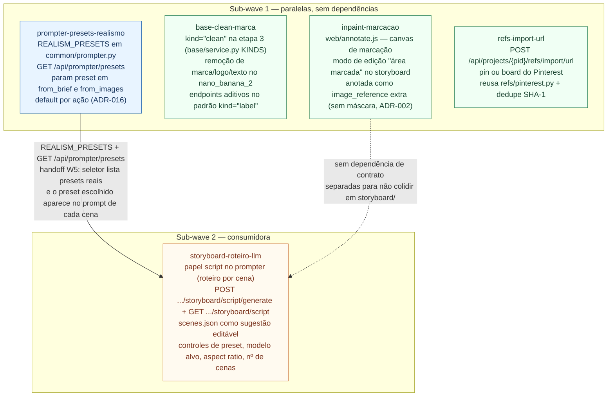

# Wave 9 — grafo de dependências

Cinco features em duas sub-waves: **1** = quatro frentes em paralelo (sem `consumes`),
**2** = `storyboard-roteiro-llm`, que consome os presets de realismo e evita conflito de
arquivos em `storyboard/` com `inpaint-marcacao`.

Fonte: `docs/domains/studio/waves/wave-9.md`.

Ordem de integração (W5): provedoras antes de consumidoras. Dentro da sub-wave 1 a ordem é
livre — sugerida: `prompter-presets-realismo` → `base-clean-marca` → `refs-import-url` →
`inpaint-marcacao` → (sub-wave 2) `storyboard-roteiro-llm`.
