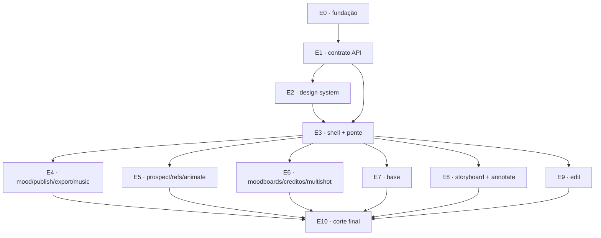

# Wave 10 — studio · Migração integral do frontend para React

> Card agregador: https://trello.com/c/Bngd5Vwi
> Plano: `docs/plano/plano-migracao-react.md` · Recon compartilhado: `docs/domains/studio/recon-wave-10.md`
> Base: `develop` · Stack destino: Vite + React + TypeScript estrito + TanStack Query + Vitest

**Natureza da wave:** refatoração pura. Muda o framework de frontend, não o comportamento.
Nenhuma tela ganha, perde ou altera função; nenhum texto de aula muda (ADR-004); o backend
não é tocado (exceção única na E10).

---

## 1. Por que esta wave existe

O frontend são 10.386 LOC de HTML/CSS/JS vanilla divididos em duas metades desiguais:
`studio/web/` (3.428, o shell e a biblioteca de UI) e `studio/etapas/*/view.{html,js}`
(6.958, os plugins de tela). Migrar isso em uma única frente seria um big-bang de meses
com a suíte QA vermelha o tempo todo. Cortado em 11 frentes com contratos explícitos, o
app fica funcional e verificável ao fim de **cada** frente.

## 2. O oráculo da migração

Os **8.256 LOC de cenários Playwright** em `scripts/qa/cenarios/` (14 telas, rodando
offline com fakes) são o que transforma "confio que ficou igual" em prova. Eles selecionam
por id, classe e data-attribute do DOM real.

> **Regra que governa a wave inteira:** os cenários passam **sem uma linha editada**.
> Se um cenário precisou mudar para passar, o comportamento mudou — isso é bug da
> migração, não ajuste de teste.

Esta é a definição operacional de "o sistema se mantém igualmente funcional".

## 3. Blocos provides/consumes

### E0 · fundação — card [REACT-01]
**Provides**
- `frontend/` — scaffold Vite + React + TS estrito + Vitest + Testing Library + ESLint, build para `studio/web/dist/`
- Job `frontend` no CI (npm ci · tsc --noEmit · vitest · build)
- ADR "Frontend em React + Vite com etapa de build" e ADR "Plugin de UI = `ui/index.tsx` descoberto por `import.meta.glob`"
- **Resolução da guarda de fronteira do núcleo** (§6.3) — sem isto a E2 trava no primeiro `make verify`

> **Correção (recon §4): nenhum ADR precisa de supersede integral.** O padrão certo é 2 ADRs novos que **emendam** quatro existentes:
> - **ADR-001** — a decisão de rede (monolito single-process, loopback) **permanece intacta**; a migração não a contraria, o `dist/` é servido pelo mesmo `/static`, sem segundo runtime. O que é emendado é a caracterização "SPA estática vanilla, sem framework, sem bundler, sem etapa de build" e o driver "iteração rápida sem pipeline de build".
> - **ADR-006** — a **decisão** (jobs em thread + polling, sem WS/SSE) fica de pé. Cai só o *driver* escrito ("frontend vanilla sem framework, sem camada de estado de UI"). Registrar isso explicitamente, senão o próximo leitor conclui que WebSocket virou opção.
> - **ADR-008** — ganha o job `frontend`. Vitest + Testing Library rodam em **jsdom**, então "testes sem navegador" continua verdadeiro; o que muda é "só ruff + pytest".
> - **ADR-010** — o mais tocado. Reafirmar (a) prontidão sempre do guia do backend e (c) etapa nova cria só a sua pasta, agora para `etapas/<id>/ui/index.tsx`; reescrever (b) para o novo endereço do núcleo (`frontend/src/**`); e **revogar o motivador "teste de frontend com Node/Playwright contraria a ADR-008"**, que deixa de valer quando o Vitest existe.
> - **ADR-004** é apenas **citado** — é o gate que proíbe "aproveitar a migração para melhorar a tela".
> Atenção: existem **dois ADR-028 distintos** no diretório (colisão preexistente). A E0 não deve reusar o número 028 nem tentar consertar isso dentro da wave.
- **Baseline QA** em `docs/qa/reports/<data>-baseline-react/` + o dump de `textContent` de todas as telas (oráculo do critério 5)
- Bloco de convenções desta wave no `CLAUDE.md` (ver §6)

**Consumes** — nada. É a raiz do grafo.

### E1 · contrato tipado da API — card [REACT-02]
**Provides**
- `frontend/src/api/schema.ts` — tipos gerados do `/openapi.json` que o FastAPI já publica
- Client HTTP tipado, equivalente exato do helper `api()` de `studio/web/app.js` (mesmo tratamento de `detail` → `Error.message`)
- Hooks TanStack Query: projetos, `GET /api/projects/{pid}/guide`, rotas por etapa
- Teste de drift de schema no CI

**Consumes** — scaffold + CI ← E0

### E2 · design system e biblioteca de UI — card [REACT-03]
**Provides**
- `frontend/src/styles/` — `style.css` (692) + `ui.css` (226) portados **sem renomear uma classe e sem reformatar** (o `test_api.py` compara strings literais — ver recon §5.1)
- `frontend/src/ui/` — **100% da superfície de `window.Studio.ui`**, nada pode faltar. Superfície real: **28 membros + 1 listener global**, enumerada com assinatura e consumidores no **recon §2** — é aquela lista que vale, não esta.
- Substituto Vitest de `tests/test_progress_modal.py` (6 de 6 testes) e da parte de `tests/test_api.py` que afirma o catálogo de classes e a superfície da `Studio.ui`

> **Correção (recon §0.1):** a versão anterior deste bloco listava `snap`, `zoom`, `tlHeight` e `js` como membros da `Studio.ui`. **Não são.** `snap`/`zoom`/`tlHeight` são campos do objeto persistido `editor.ui` em `projects/<pid>/edit/timeline.json` — estado de domínio da etapa de edição, portado pela **E9**, não pela E2. `js` era ruído de match sobre a string `"ui.js"`. A lista também omitia `fmtPct`, `guide`, `STATUS_LABEL`, `ITEM_LABEL`, `STATUS_KIND` e o **listener global de `data-copy`** (`ui.js:755-768`), que é fácil de esquecer e afeta todo markup que emite `data-copy` cru.

**Consumes** — scaffold ← E0 · client tipado ← E1 (`confirmCost`/`refreshCredits` batem em `/api/creditos/cost`)

### E3 · shell React + ponte strangler — card [REACT-04]
**Provides**
- Shell React: sidebar, seletor de campanha, rail das 11 etapas com estado real do guia, topbar com pipeline segmentado, visão geral, wizard de campanha, tema pré-paint
- Roteamento por hash com a **mesma gramática** (`#/<pid>/<step>`, `#/<pid>/overview`, `#/moodboards[/<mbid>]`, `#/creditos`) e as mesmas chaves de `localStorage` (`studio.theme`, `studio.pid`, `studio.view`)
- **Contrato de host do plugin React** — a API que as seis frentes de tela consomem: descoberta por `import.meta.glob('../../etapas/*/ui/index.tsx')` e o `ctx` equivalente (`api`, `toast`, `pid()`, `project()`, `files()`, `guide()`) com o ciclo `init/onProject/destroy`
- **Ponte de compatibilidade `window.Studio`** — hospeda as 10 etapas ainda vanilla via `/steps/<id>/view.*` com contrato idêntico (`register`/`go`/`onGuide`/`ctx`)
- Flag `STUDIO_UI=react` (vanilla segue no default até a E10)
- Substituto Vitest de `tests/test_reset_shell.py`

**Consumes** — biblioteca de UI ← E2 · hooks do guia ← E1

### E4 · lote A: mood, publish, export, music — card [REACT-05]
**Provides** — `studio/etapas/{mood,publish,export,music}/ui/index.tsx`; remoção dos 4 pares `view.{html,js}` (816 LOC); substitutos Vitest de `test_mood_view.py` **e** dos asserts sobre `view.*` em `test_music_api.py`, `test_publish_api.py`, `test_export_api.py`, `test_export_guide.py` e `test_vibes_api.py` (recon §7.1 — a versão anterior citava só o `test_mood_view.py`)
**Consumes** — contrato de host do plugin React ← E3 · ui lib ← E2 · hooks ← E1

### E5 · lote B: prospect, refs, animate — card [REACT-06]
**Provides** — `studio/etapas/{prospect,refs,animate}/ui/index.tsx`; remoção de 1.186 LOC; substitutos Vitest de `test_refs_view.py` **e** dos asserts sobre `view.*` em `test_animate_api.py` (inclui guardas "removido pela wave 4, não pode voltar"), `test_prospect_api.py` e `test_refs_import_url.py` (recon §7.1)
**Consumes** — idem E4. Atenção: `animate` depende do `usePoll` (jobs assíncronos, ADR-006) e `refs` do `useUpload` — ambos providos pela E2.

### E6 · lote C: áreas globais — card [REACT-07]
**Provides** — mood boards, créditos e o componente compartilhado Multishot (ADR-017) em React; teste Vitest **novo** do componente `Multishot`; remoção de 854 LOC

> **Correção (recon §7.1):** a versão anterior prometia "substituto Vitest de `tests/test_multishot.py`". **Errado** — esse arquivo é backend puro (`studio/common/multishot.py` + rotas HTTP), 0 de 6 testes tocam frontend. Ele **continua em pytest, intocado**. O que a E6 precisa é de um teste Vitest novo para o componente, não de substituição. A E6 também emenda o **endereço** no ADR-017 (o componente deixa de ser `studio/web/multishot.js` + global `Studio.multishot` e vira componente React compartilhado — a decisão "existe um componente único e reutilizável" permanece).
**Consumes** — idem E4. As rotas `moodboards` e `creditos` são **reservadas** e tratadas antes do check de campanha — comportamento provido pelo roteador da E3.

### E7 · lote D: etapa Base — card [REACT-08]
**Provides** — `studio/etapas/base/ui/index.tsx`; remoção de 918 LOC; substitutos Vitest de `test_prompter_presets_view.py` **e** dos ~15 testes de `test_base_api.py` que leem `base/view.*` (26 referências, inclui `test_contrato_dom_da_etapa`) — omissão da versão anterior (recon §7.1)
**Consumes** — idem E4.

### E8 · lote E: Storyboard + canvas de marcação — card [REACT-09]
**Provides** — `studio/etapas/storyboard/ui/index.tsx` + o canvas de marcação encapsulado em componente com `ref` (lógica de desenho **não** reescrita); remoção de 1.947 LOC; substitutos Vitest de `test_storyboard_view.py` (46 de 48 testes — o maior bloco isolado da wave) **e** dos asserts sobre `view.*` em `test_storyboard_api.py` e `test_storyboard_angles_api.py` (recon §7.1). Os 3 `node --check` viram `tsc --noEmit`.
**Consumes** — idem E4.

### E9 · lote F: etapa Edit — card [REACT-10]
**Provides** — `studio/etapas/edit/ui/index.tsx`; substitutos Vitest dos trechos de UI de `test_edit_editor.py`/`test_edit_captions.py`; remoção de 2.281 LOC
**Consumes** — idem E4, mais `snap`/`zoom`/`tlHeight` da E2 (usados só por esta tela).

### E10 · corte e fechamento — card [REACT-11]
**Provides** — React default; remoção da ponte, da flag e do vanilla residual; remoção da rota `/steps/<id>/view.{html,js}` de `studio/app.py`; `studio/web/dist/` versionado + guarda de CI; HLD, `CLAUDE.md`, `docs/qa/config.md` e ADRs atualizados
**Consumes** — **todas** as telas migradas ← E4…E9 · ponte ← E3

## 4. Grafo de dependências

### Correção ao plano original

O plano previa **E6 antes de E8** ("storyboard consome o multishot"). A inspeção do código
desmente: `studio/etapas/storyboard/view.js` tem **zero** ocorrências de `multishot`, e o
único consumidor de `window.Studio.multishot` é `studio/web/moodboards.js` — que está no
mesmo lote E6. **A dependência não existe**, e as seis frentes de tela paralelizam inteiras.

## 5. Sub-waves

| Sub-wave | Frentes | Cards | Paralelismo |
| --- | --- | --- | --- |
| 1 | E0 fundação | [REACT-01] | série |
| 2 | E1 contrato API | [REACT-02] | série |
| 3 | E2 design system | [REACT-03] | série |
| 4 | E3 shell + ponte | [REACT-04] | série |
| 5 | E4 · E5 · E6 · E7 · E8 · E9 | [REACT-05..10] | **6 frentes em paralelo** |
| 6 | E10 corte final | [REACT-11] | série |

As quatro primeiras sub-waves são estritamente sequenciais: cada uma constrói a fundação
que a próxima consome. O paralelismo real da wave está na sub-wave 5 — seis frentes
tocando pastas disjuntas.

## 6. Convivência entre as frentes (adendo ao `references/ambiente.md`)

Duas colisões específicas desta wave, resolvidas por regra:

1. **`studio/web/dist/` é artefato compartilhado.** Se seis frentes commitarem bundles
   rivais, todo merge conflita em código minificado. Regra: `dist/` fica no `.gitignore`
   durante a wave; o **único** commit do bundle acontece na E10, junto com a guarda de CI.
   Isso preserva a decisão aprovada (dist versionado no estado final, porque o usuário
   desta ferramenta local não tem Node) e elimina o conflito.
2. **Rodadas de QA colidem em porta e diretório.** `scripts/qa/stack-up.sh` já resolve a
   primeira porta livre a partir de 8790 e isola por `<run-id>`, e `.qa/` é gitignored —
   basta cada frente usar `RUN=<nome-da-frente>`. Regra: nunca `RUN=local` numa frente.

Ambas entram no `CLAUDE.md` pela frente E0 (que roda sozinha, antes de qualquer
paralelismo), e não por edição direta em `develop`.

### 6.3 ⚠ Guardas de diff que reprovam a wave por construção

Descoberto no recon (§7.3) e **verificado no código**. Duas guardas em pytest fazem
`git merge-base develop HEAD` e falham se a branch tocar o núcleo:

| Guarda | Onde | Reprova se |
| --- | --- | --- |
| `test_diff_da_feature_nao_toca_o_nucleo` | `tests/test_prompter_presets_view.py:90-113` | qualquer caminho no diff **ou no `git status --porcelain`** começa com `studio/web/`, `studio/app.py`, `studio/steps.py`, `studio/index.html` ou `studio/etapas/mood/view.` |
| `test_t3_13_nucleo_do_shell_intocado[…]` | `tests/test_storyboard_view.py:521-535` | `studio/web/ui.js` ou `studio/web/style.css` mudam em relação ao `merge-base` |

Impacto: **E2** (porta `ui.js`/`style.css`), **E3** (reescreve `app.js`/`index.html`),
**E6** (remove `moodboards.js`/`creditos.js`/`multishot.js`) e **E10** (remove tudo e edita
`studio/app.py`) reprovam em `make verify` sem ter feito nada errado.

**Por que isso acontece:** as guardas materializam o item (b) do ADR-010 — "tela nunca edita
`studio/web/*`" — mas moram dentro de arquivos de teste de *feature específica*
(`test_prompter_presets_view.py` é da feature de presets de realismo;
`test_storyboard_view.py` é do storyboard) enquanto afirmam um invariante *do repositório
inteiro*. Elas foram escritas para proteger frentes **de etapa**; a Wave 10 é frente
**de núcleo**, o caso que ninguém previu.

**Resolução (E0, registrada no ADR do plugin de UI):** extrair as duas para uma única
guarda de fronteira em `tests/test_adr010_fronteira_nucleo.py`, que afirma o invariante que
**continua valendo** — *frente de etapa não toca o núcleo* — com a titularidade declarada
explicitamente em vez de hardcoded num teste de feature. Frente de núcleo (as da wave)
declara sua titularidade e passa; frente de etapa continua barrada como hoje. Isso preserva
a proteção do ADR-010 em vez de desligá-la, que é o que um `skip` faria.

### 6.4 ⚠ Escopo de CSS: o vazamento que o vanilla escondia

Descoberto no recon (§5.2). **9 dos 10 `view.html` têm um bloco `<style>`** — `edit` tem
**315 linhas**, `base` 113, `storyboard` 110 (`music` é o único sem). Esse CSS nunca foi
escopado de verdade: ele só não vaza porque `main.innerHTML = ...` **remove o `<style>`
junto** ao trocar de tela.

Em React, CSS importado é **global e permanente**. Portar esses blocos ingenuamente faz o
CSS da etapa de edição vazar para a etapa de mood e vice-versa — e o detector é a auditoria
visual do harness (texto cortado, controle coberto, overflow), não um teste unitário.

**Regra para as frentes de tela:** o CSS de tela vira CSS Module ou é envelopado em
`:where(.escopo-da-tela)`. Nunca import global. E a E2 **não pode "limpar" o CSS ao portar**:
duas regras aparentemente redundantes (`.inline input.mini`, `.ctl input.mini`) existem para
consertar bugs de especificidade encontrados na wave 4 — apagá-las traz dois bugs visuais de
volta. Reformatar também quebra: `test_api.py` compara strings **literais**.

## 7. Critérios cross-feature (regra de ouro do handoff)

Cada `consumes` vira critério cobrado na integração (W5), com evidência real:

| Handoff | Evidência exigida na integração |
| --- | --- |
| E4…E9 ← E3 (contrato de host) | O cenário QA da tela passa **dentro do shell React**, não só o teste unitário do componente |
| E4…E9 ← E2 (ui lib) | Os seletores do catálogo de classes aparecem no DOM renderizado pelo React |
| E3 ← E2 | `make qa-run TELAS=shell overview` verde nas duas UIs (vanilla e React) |
| E10 ← E4…E9 | Rodada QA **completa** verde + diff de `textContent` contra o baseline da E0 = vazio |

## 8. Definição de pronto por frente

Os seis critérios têm de fechar. Frente que não fecha volta, não avança.

1. `make qa-run` (telas afetadas) verde com cenários **inalterados**
2. `make qa-api` sem diferença de contrato
3. `make verify` verde; nenhum teste removido sem substituto
4. Nenhum `service.py` / `router.py` / `guide.py` no diff
5. Diff de `textContent` contra o baseline da E0 = vazio
6. `make run` sobe e as 11 etapas navegam
