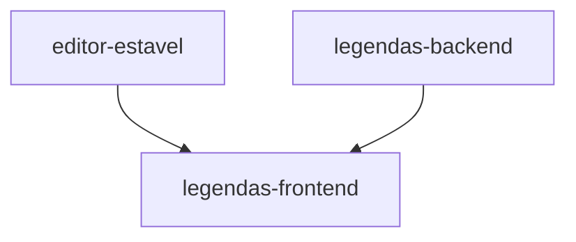

# Wave 8 — Studio de vídeo: editor estável + legendas com karaokê [extensão]

**Recon:** `docs/domains/studio/recon-wave-8.md` · **Plano aprovado:** `.claude/plans/2026-08-29-studio-de-video-estavel.md`
· **Data:** 2026-08-29 · **Modo:** dd-parallel (3 frentes, 2 sub-waves) · **Card da wave:** <https://trello.com/c/6Eg28v10>
· Tudo `[extensão]` da etapa 7 (aula 014 não ensina editor com camadas nem legendas; ADR-030 cobre o editor; a
transcrição por serviço externo nasce em **ADR-024**).

## Composição

| Frente | ID / card | Branch | Sub-wave | Escopo | provides | consumes |
|---|---|---|---|---|---|---|
| **A · editor-estavel** | ADH-OS-20260829-38 · <https://trello.com/c/uDU7Hyfh> | `feature/adh-os-20260829-38-editor-estavel` | 1 | itens 1–8 do plano: render incremental (`commit`→`renderDirty`, nunca `renderRoot`), timeline sempre visível (`ui.tlHeight`), excluir clipe/música, MP4 na VÍDEO 2 (pool + CSS), escolher/mover V1↔V2, efeitos/filtros em texto/legenda/overlay, esconder sidebar, etapa 7 = "Studio de vídeo" | `renderLayers` reconciliado por `data-uid` com hook por tipo de camada; `adjustTarget` para `text`/`caption`; `editor.py` persiste `effects/filters/presetCss` em `text`/`caption` e `ui.tlHeight`; `commit(label, mutator, opts)` | — |
| **B · legendas-backend** | ADH-OS-20260829-39 · <https://trello.com/c/bzh7UKVT> | `feature/adh-os-20260829-39-legendas-backend` | 1 | item 9 servidor: `studio/edit/captions/` (transcrição + layout), rotas `captions/*`, normalização `words/mode/hi/chunk` de `caption`, burn-in karaokê, dep `openai`, `OPENAI_API_KEY`, ADR-024 | contrato HTTP abaixo; itens `caption` com `words` sobrevivendo ao PUT; PNG por palavra no `master.mp4` | — |
| **C · legendas-frontend** | ADH-OS-20260829-40 · <https://trello.com/c/DvXiT1oU> | `feature/adh-os-20260829-40-legendas-frontend` | 2 | item 9 UI: modal "Gerar legendas", karaokê no preview, propriedades de legenda | UI de legendas | `renderLayers`/`commit(opts)` ← **A**; contrato `captions/*` + `words` persistidas ← **B** |

Regra de arquivos (evita corrida): **A** = `studio/etapas/edit/view.js`, `view.html`, `studio/etapas/edit/__init__.py`,
`studio/steps.py`, `README.md`, `editor.py` (só `normalize_item` text/caption + `normalize_ui`), testes correspondentes.
**B** = `studio/edit/captions/**` (novo), `studio/etapas/edit/router.py` (rotas novas, aditivas), `studio/edit/burnin.py`, `studio/edit/render.py` (aditivo: spec `kind:"concat"` para o fallback de faixa),
`studio/edit/editor.py` (só o ramo `caption` de `normalize_item`: `words/mode/hi/chunk`), `studio/common/settings.py`,
`requirements*.txt`/`pyproject.toml`, ADR-024, testes novos. **C** = `view.js`/`view.html` (depois de A integrada).
Ninguém toca `ui.js`/`ui.css`/`style.css`/`app.py`/`index.html`/`app.js`.
Sobreposição conhecida: `editor.py::normalize_item` (A e B, ramos diferentes) e `tests/test_edit_editor.py` (A e B
adicionam testes) → B rebaseia sobre A na integração.

## Grafo de dependências



Sub-wave 1 = A ∥ B (arquivos disjuntos salvo `editor.py`). Sub-wave 2 = C (nasce da `develop` já com A e B).

## Critérios cross-feature (cobrados na W5)

- **C ← A:** legenda com `words` renderiza como spans `[data-cap-widx]` dentro da camada reconciliada; ao arrastar/trim do
  item, `paintKaraoke` continua acendendo a palavra certa sem `renderRoot`. Evidência: smoke Playwright no estado integrado.
- **C ← B:** o modal chama `POST /captions/generate` e os itens devolvidos entram em `t_cap` e sobrevivem ao `PUT /timeline`
  + reload (`words`/`mode`/`hi` presentes no GET). Evidência: request na coleção Postman de B + teste de API de C.
- **B → render:** `POST /render` com legenda karaokê gera N PNGs (N = palavras) e o filtergraph tem N `overlay … enable=between`.

## Contrato HTTP CONGELADO (frente B; prefixo `/api/projects/{pid}/edit`)

1. `POST /captions/generate` — body:
   ```json
   {
     "source": "script" | "audio",
     "text": "roteiro colado (obrigatório em script; opcional em audio: quando presente, ALINHA nosso texto ao tempo ouvido)",
     "file": "caminho relativo ao projeto (obrigatório em audio): videos/<cena>/<shot>_take1.mp4 | audio/music.mp3 | edit/media/<x>.mp4 | edit/narration/<x>.wav",
     "start": 0.0,
     "duration": 12.5,
     "mode": "karaoke" | "linha" | "bloco",
     "chunk": 6,
     "hi": "#C8F751",
     "position": "top" | "middle" | "bottom",
     "style": { "size": 34, "weight": 700, "align": "center", "color": "#FFFFFF", "bg": "transparent" }
   }
   ```
   Defaults: `start=0`, `duration` = duração do arquivo (audio) ou `len(words)/2.4` (script), `mode="karaoke"`, `chunk=6`
   (0 = uma janela por linha de largura), `hi="#C8F751"`, `position="bottom"`, `style` = preset de legenda do editor.
   Resposta `200`:
   ```json
   {
     "source": "estimate" | "whisper",
     "word_count": 42,
     "total_s": 12.5,
     "warning": "opcional: string (ex.: \"whisper indisponível: tempos estimados\"); ausente quando não há aviso",
     "items": [
       { "id": "cap_x1", "start": 0.0, "end": 2.31, "text": "Você já parou pra pensar",
         "mode": "karaoke", "hi": "#C8F751", "chunk": 6,
         "words": [ { "w": "Você", "start_s": 0.0, "end_s": 0.31 }, { "w": "já", "start_s": 0.31, "end_s": 0.5 } ],
         "style": { "size": 34, "weight": 700, "align": "center", "color": "#FFFFFF", "bg": "transparent" },
         "transform": { "x": 0.5, "y": 0.82, "scaleX": 1, "scaleY": 1, "rotation": 0, "opacity": 1 },
         "anim": { "in": "fade", "out": "fade" } }
     ]
   }
   ```
   Cada item já está no shape de `editor.tracks[t_cap].items[]`; `words[].start_s/end_s` são segundos **absolutos** da
   timeline (`start` somado). O servidor **não persiste**: o front insere via `commit()` e o `PUT /timeline` normal salva.
   Erros: `422` com `detail` string iniciado pelo nome do campo (`"text: obrigatório em script"`, `"file: …"`, `"hi: …"`, `"mode: …"`) (`text` vazio em `script`; `file` ausente/inválido; `mode` fora de `karaoke|linha|bloco`; `hi` não `#RRGGBB`; wav extraído > 25 MB; whisper reconheceu zero palavras sem `text`),
   `404` (arquivo não existe), `502` (`ProviderError` do whisper — nunca cai em `estimate` silenciosamente quando `source=audio`
   sem `text`; com `text`, cai em `proportional` e responde `source:"estimate"` + `warning`).
2. `POST /captions/narration/upload` — multipart `files[]` (`.wav .mp3 .m4a .ogg .mp4 .mov .webm`) → `{ added, files:[{file, duration}] }`,
   grava em `edit/narration/` (mesmo padrão de `sfx/upload`). `GET /captions/narration` → lista `[{file, name, duration}]`.
3. `PUT /timeline` (existente) — item de `caption` aceita os campos aditivos `mode`, `hi`, `chunk`, `words`; itens sem eles
   continuam byte-idênticos (retrocompat). `words` inválidas são descartadas (nunca 422); `mode` inválido vira `bloco`.
4. `POST /render` (existente) — legenda `karaoke` gera um PNG por palavra, `linha` um por item, `bloco` como hoje.

Constantes compartilhadas (não divergir entre Python e JS): `WPS = 2.4`; regra do **centro** da palavra para pertencer a
uma janela (`a <= (start_s+end_s)/2 < b`); `CAPTION_MODES = ("karaoke", "linha", "bloco")`; `HI_COLORS =
["#C8F751", "#57E2F0", "#F2B544", "#A78BFA"]`; `CHUNK_OPTS = [0, 6, 4, 2]`.

## Decisões determinísticas da W2 (do recon)

- **ADR-024** para a transcrição (sequência da `mapping.md`); a frente B também indexa a ADR-030 na `mapping.md`.
- Renomear a etapa toca `steps.py` (núcleo): a frente A assume o papel de "preparo" nessa linha e registra no PR.
- `editor.py`: B escreve `normalize_caption_extra(raw)` chamado no ramo `caption`; A só acrescenta `effects/filters/presetCss` e `ui.tlHeight`.
- Fonte "roteiro" na UI = textarea; pré-preenchimento opcional com `storyboard/scenes[].text` rotulado "descrição das cenas (não é fala)".
- Fonte "áudio" = upload em `edit/narration/` ou arquivo já no projeto; extração com `ff.run([...,"-vn","-ac","1","-ar","16000",...])` atrás de `ff.available()` (409 `NO_FFMPEG`).
- Burn-in karaokê: PNG por palavra pelo caminho `overlay … enable=between` existente; se o número de inputs de um render passar de 200, B cai para faixa + `ffconcat` (`videoengine/slideshow.py:354-385` do ContentFlow como referência). MP4 na V2 e efeitos em texto seguem **preview-only** no master (ADR-030: nunca simular), com rótulo na UI.
- Chave `OPENAI_API_KEY` lida em runtime em `studio/edit/captions/` (não em `settings.py`, que é o livro-caixa da ADR-016); SDK `openai` importado lazy; `requirements.txt` é a única lista de deps.
- Bug latente incluído em A: `deleteItems` de SFX por índice (`sfx_${i}`) quebra multi-exclusão → excluir por referência.

## Gate em lote (W3) — aprovado por delegação do dono (2026-08-29)

FDDs: `docs/domains/edit/features/editor-estavel-fdd.md` (A, SDD), `legendas-backend-fdd.md` (B, SDD),
`legendas-frontend-fdd.md` (C, direta). Pendências resolvidas no lote: `render.py` entra na regra de arquivos de B;
422 ampliado (wav > 25 MB, zero palavras); `warning` e formato do `detail` congelados acima. Fora desta wave: custo do
whisper no livro-caixa (ADR-016) e transcrição assíncrona — vão para a retro.

## Fidelidade (CLAUDE.md)

A aula 014 monta no CapCut sem legendas nem camadas; tudo desta wave é `[extensão]` já aprovada pelo dono do produto
(plano aprovado em 2026-08-29). O backbone do ffmpeg (clipes V1, pretos, música, SFX) não muda.
