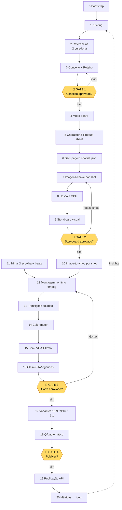

# Plano de Automação — Produção de Vídeos com IA
### Baseado no curso "O Orquestrador — Iniciante" (ABRAhub), 15 aulas transcritas

> **Fonte:** `media/0XX--curso-iniciante-o-orquestrador-abrahub.txt` (aulas 001, 003–015, 017; as aulas 002 e 016 não têm transcrição — são páginas sem vídeo).
> **Convenção:** tudo que é atribuído ao instrutor cita a aula `(0XX)`. O que é acréscimo meu está marcado **[INFERÊNCIA]** ou **[OPINIÃO]**. Disponibilidade de API está marcada **[VERIFICAR]** quando não posso confirmar hoje.
> **Verificação web (24/08/2026):** Higgsfield tem CLI oficial, skills para Claude Code, MCP e API; OpenArt tem MCP; Midjourney segue sem API pública. Fontes: [CLI](https://github.com/higgsfield-ai/cli), [MCP](https://higgsfield.ai/mcp), [help center CLI/MCP](https://higgsfield.ai/creator-hub/help-center/mcp-cli/how-do-i-access-higgsfield-via-cli), [docs API](https://docs.higgsfield.ai/docs), [OpenArt MCP](https://openart.ai/mcp/), [Kling API](https://apiframe.ai/guides/kling-image-to-video-api-python-tutorial), [Midjourney sem API](https://www.wireflow.ai/blog/best-midjourney-api-tools-in-2026).
> **Ambiente verificado nesta máquina (24/08/2026):** Python 3.12, Node 24, GPU RTX 3080 (WSL2), 16 CPUs / 15 GB RAM. **ffmpeg NÃO instalado**, nenhuma chave de API configurada.

---

## Sumário

1. [Fase 1 — Extração fiel do curso](#fase-1)
   - 1.1 Mapa aula-a-aula
   - 1.2 Inventário de ferramentas
   - 1.3 O método canônico do instrutor
   - 1.4 Filosofia e posicionamento
2. [Fase 2 — Análise crítica](#fase-2)
3. [Fase 3 — Plano de automação](#fase-3)
   - 3.0 Pipeline estágio a estágio (tabela)
   - 3.1 O que eu faço sozinho / o que depende de humano / o que depende de API
   - 3.2 Níveis de maturidade N1 → N2 → N3
   - 3.3 Estrutura de projeto, schema do shotlist e skills do Claude Code
   - 3.4 Gates humanos
   - 3.5 Biblioteca de prompts
4. [Fase 4 — Plano de execução](#fase-4)
   - 4.1 Roadmap por sprints
   - 4.2 Piloto completo (briefing → comandos)
   - 4.3 Métricas
5. [Decisões que só você pode tomar](#decisoes)

---

<a id="fase-1"></a>
## FASE 1 — Extração fiel do curso

### 1.1 Mapa aula-a-aula

| Aula | Título inferido | Objetivo | Conceitos-chave | Ferramentas | Passos práticos ensinados |
|---|---|---|---|---|---|
| **003** | Boas-vindas / O que é um Orquestrador | Alinhar mentalidade e meta do curso | "Orquestrador de IA = combina múltiplos modelos e coordena tudo em torno de um projeto; gestão de pessoas sem pessoas". Meta: **primeiro vídeo profissional publicado em 48h** | — | Apresentar-se no feed da comunidade |
| **004** | Tour pela comunidade | Explicar gamificação e ferramentas internas | Níveis por engajamento desbloqueiam bot (nível 3), pack de mood boards (nível 2), Abrahub Cinema Studio | Abrahub Cinema Studio, chatbot, mood boards | Postar, interagir, subir de nível |
| **005** | Como o curso funciona | "Processo > plataforma" | "Não fique preso às plataformas, fique preso ao processo"; inserções de atualização no meio das aulas | — | — |
| **006** | Setup de ferramentas | Escolher e pagar plataformas | Custo fixo ≈ US$60/mês como "custo básico da sua empresa"; *one-person business*; comparação com faculdade | **Midjourney** (Standard US$24–30/mês — depois **cancelado** pela equipe), **Higgsfield** (Ultimate ≈ US$30/mês anual), Nano Banana Pro, Kling 2.6, Google Flow (opcional) | Assinar Higgsfield; Midjourney opcional |
| **007** | Midjourney + bot de prompts | Familiarizar com geração de imagem e o bot | *Stylization* (aderência ao prompt) e *Weirdness* (criatividade) — "nada ao extremo é bom, IA alucina nos extremos"; **"intenção" no prompt** = mood + ângulo + câmera + estilo; prompt em inglês | Midjourney (Create, Edit/Retexture/Expand, Mood boards/Personalize), **Abrahub Creative Engine** (GPT custom) | Bot: modo guiado (propósito → tom emocional → referência estética → descrição) ou simplificado; prompt sai com câmera/lente/abertura/foco |
| **008** | Modelos vs. plataformas + preços | Decidir onde gastar | "Plataforma nenhuma gera vídeo; quem gera são os **modelos**". Plataformas são "postos de gasolina": comparar **velocidade, estabilidade, custo**. Modelos aceitáveis no momento: **Seedance 2.0** (melhor), **Kling 3.0**, "Omni Flash" do Google (mais barato) | **OpenArt** (recomendado nessa inserção, plano ≈ US$56/mês, cupom 15%), Higgsfield (desaconselhado nessa inserção por marketing agressivo) | Assinar plano que não deixe na mão; virar parceiro de plataforma após viralizar |
| **009** | Início da campanha: referências, mood, imagem-base | Chegar à **imagem base da campanha** | Pastas por projeto; brainstorming ≠ mood; *style reference* vs *image prompt* vs *omni reference*; mood board ligado muda tudo; usar nova aba do GPT "sem viés" para prompt idêntico à referência | Pinterest, Midjourney Explore (copiar prompts), GPT/bot, Midjourney Mood boards, Higgsfield + **Nano Banana** (trocar rótulo), Higgsfield Soul *Color Transfer*, **Upscale 2x High Fidelity V2** | 1) Pinterest → salvar refs em `brainstorming/` 2) Explore → achar vibe 3) Bot gera prompt de mood 4) Gerar 4 variações → mood board 5) Para cada ref: bot gera prompt "lata na mesma situação" 6) Escolher imagem base 7) Nano Banana troca marca 8) Upscale |
| **010** | Da imagem base ao storyboard | Ter 5 cenas roteirizadas | **Draw to Edit** (desenhar ideia sobre a imagem); instruções **uma de cada vez**, simples; gerar 4 imagens quando incerto, 1 quando é "tweak"; **Multi Shot** para ângulos; **Inpaint**; storyboard em Google Docs | Higgsfield (Draw to Edit, Multi Shot, Inpaint, Upscale), Nano Banana, Google Docs | Cenas: 1 close astronauta andando na nevasca; 2 encontra a lata gigante; 3 olha o chão e vê a corda; 4 puxa; 5 lata cai e inunda |
| **011** | Frames por cena + realismo | Cada cena com vários ângulos consistentes | Problema do **"cheiro de plástico"** da IA; **Abrahub Cinema Studio** (realismo com prompt simples, presets de câmera/lente/abertura/mood); pasta `imagens/cena N/`; instruções de edição numeradas (1. capacete com insulfilm 2. eliminar lata 3. em movimento); "o ideal seria acertar cores/luz **antes** do multishot" | Abrahub Cinema Studio, Higgsfield Multi Shot, Upscale | Por cena: imagem base → multishot → escolher → upscale → salvar → ordenar prints no storyboard |
| **012** | Animação (image-to-video) | Todos os takes gerados | **Kling 2.6** "entende melhor"; prompt simples para cena simples; bot de **movimento** (analisa imagem; 3 modos); **Kling 2.5 Turbo** para *start/end frame*; **10 s** para transições lentas; **desligar áudio** do modelo (resolver na pós); testar outros modelos (Seedance "bom para movimento") após 3–4 falhas; "**paciência**"; trabalhar em paralelo enquanto gera; solução criativa: mudar posição das nuvens para dar time-lapse; fallback **corte para preto** quando o plano-sequência falha; nomear `cena1_video1` | Higgsfield (Kling 2.6 / 2.5 Turbo, Seedance), bot de movimento | Por take: imagem → prompt → gerar 2 → like no usável → download → pasta `videos/cena N/` |
| **013** | Trilha ANTES da montagem | Escolher música e cena extra de produto | "**A trilha dita o ritmo dos cortes**; montar antes da trilha soa amador"; batidas fortes = algo acontece; cena final precisa mostrar o produto | **CapCut**, bibliotecas: CapCut, Artlist, Envato, Musicbed, Epidemic Sound, **YouTube Audio Library** (grátis, música + SFX); Abrahub Cinema Studio (RED comercial, Dutch angle, ultra-wide, mood preset) | Jogar clipes na timeline sem editar → sentir músicas → escolher → criar cena extra (geladeira congelada) → animar |
| **014** | Montagem no ritmo + SFX | Vídeo base pronto | Exportar **último frame** → usar como *start frame* da próxima cena (transição "cola"); cortes nos impactos; **speed ramp** com *frame blending*; marcadores; **quadros pretos** nos impactos; cortar a música para o ápice; fade de opacidade no fim; SFX "trabalho de formiguinha" (respiração de astronauta, ambiente) | CapCut (velocidade/curvas, mistura de quadros, marcadores, exportar quadro parado) | Publicar mesmo que "todo primeiro trabalho fica ruim" |
| **015** | Próximos passos / afiliação | Portfólio de 4 vídeos | Publicar 4 vídeos criativos antes de prospectar; afiliação 35% | Redes sociais | Criar perfil, publicar 4 vídeos, pedir feedback |
| **001** | Monetização (aula desbloqueada no nível 3) | Primeiros clientes | Mar azul de pequenos negócios; **script de DM** (10/dia); teaser de **5–10 s com música**; call de 15 min; **tabela de etapas de produção** (conceito, mood board, roteirização, direção criativa…) para ancorar valor; oferta só-agora (50% off no 1º job); **50% entrada / 50% entrega**; começar em **R$100–500** por vídeo de 30 s–1 min; vender **resultado**, não IA; stock (Envato/Artlist) como renda alternativa | Instagram DM | Prospecção diária + teaser + call |
| **017** | Encerramento | Anunciar curso avançado (linguagem de cinema) | — | — | — |

**Prompts / fórmulas literais do instrutor** (para a biblioteca da Fase 3.5):

- (007) Bot modo simplificado: *"É uma campanha publicitária de adoção de cães. Quero um cãozinho chupando melancia em tom cinematográfico."* → sai prompt em inglês com câmera, lente, abertura, foco.
- (007) Bot modo guiado: propósito → tom emocional → referência estética (filme/foto/campanha, ou "escolha por mim") → descrição.
- (009) *"Quero uma imagem para uma campanha de energético que tenha o mood parecido com o da primeira imagem fornecida. Bastante neon, neve… Porém não tenho interesse em pessoas."*
- (009) Prompt "sem viés" em nova aba: *"Crie o prompt de uma imagem idêntica a esta. Porém o energético gigante está em uma montanha coberta de neve."*
- (009) Edição Nano Banana: *"Troque o rótulo da lata. Mantenha as cores da lata, mas adicione uma logomarca no formato de raio com efeito neon."*
- (010) *"Faça com que o alpinista seja ainda menor e mais realista."* / *"Elimine o pequeno personagem da parte direita."* / Inpaint: *"Tem uma corda pendurada do topo da lata até o chão… mais fina e proporcional ao tamanho do personagem, e realista."*
- (011) Multi-ângulo: *"Me traga um outro ponto de vista desta imagem. Quero um close no astronauta."*
- (011) Edição numerada: *"Quero as seguintes modificações. 1. Faça com que o capacete tenha insulfilme, tornando impossível ver o rosto. 2. Elimine a lata do fundo. 3. Faça com que ele esteja em movimento, caminhando em meio à nevasca."*
- (012) Movimento: *"Quero que ele esteja caminhando para frente em meio à nevasca. Ele está com muita dificuldade de se locomover."* / *"Dolly dramático focando no reflexo de seu capacete."* / *"Movimentação de câmera bem dramática demonstrando o contraste de tamanho entre o personagem e a lata."* / Start-end: *"Esta é uma cena start frame e end frame. O clima rapidamente se modifica. A movimentação de câmera deve ser lenta e dramática."* / *"…no último segundo da cena se agacha para pegar o objeto; a cena corta no momento em que começa a se agachar."* / *"…o último frame deve ser com a lente 100% debaixo d'água, totalmente borrado, como se um tsunami tivesse pego a câmera."*
- (013) Cena extra: *"Troque a lata da imagem 1 pela da imagem 2."* → *"Retire o texto abaixo da lata e faça com que tudo ao redor dela esteja congelado."* → animação: *"Câmera se aproxima da lata enquanto a mulher pega em câmera lenta."*
- (014) Transição: *"A lente da câmera está totalmente congelada e vai descongelando até que a imagem da geladeira fique nítida."*
- (001) Script de DM: *"Oi [nome]. Eu sou [fã/consumidor] da sua marca. O seu post a respeito de [X] realmente ressoou comigo. Quero ser bem direto: eu produzo anúncios criativos para [empresas/marcas]. Você pode acompanhar meu portfólio no meu perfil. Tive uma inspiração e criei algo para o seu negócio. Quer ver como ficou?"* (sem links). Follow-up: *"Aqui está o início. Se quiser, podemos agendar uma call de 15 minutinhos e te explico a minha ideia para esse anúncio completo."*

### 1.2 Inventário de ferramentas

| Ferramenta | Papel no pipeline (segundo o curso) | Entrada → Saída | Custo citado | Limitações citadas | Acesso programático |
|---|---|---|---|---|---|
| **Midjourney** | Ideação, mood boards, style reference, edit/retexture/expand (006, 007, 009) | prompt/imagem → 4 imagens | US$8–10 básico; **Standard US$24 anual / 30 mensal**, 15 h fast + relax ilimitado; 200 img/mês no básico | Erra mãos (009); "insubstituível" em mood boards, mas equipe **cancelou** (006, 009) | **VERIFICADO:** sem API pública (só enterprise, sob aplicação); V8.1 tem image-to-video nativo. Automação por browser viola ToS → **[UI-manual]** |
| **Higgsfield** | Hub principal: Nano Banana Pro, Kling 2.6/2.5 Turbo/3.0, Seedance, Draw to Edit, Multi Shot, Inpaint, Upscale, Soul/Color Transfer (006, 009–013) | imagem+prompt → imagem/vídeo | Pro ≈ 600 créditos; **Ultimate ≈ US$30/mês anual** ("não deixa na mão", Nano Banana ilimitado no momento) | Lento em alguns dias (011); bugs no Multi Shot (011); marketing "letras miúdas", fila no ilimitado (008); serviço ruim → depois melhorou (006) | **VERIFICADO 24/08/2026:** CLI oficial `@higgsfield/cli` (`higgsfield auth login` via OAuth, sem API key; `higgsfield generate create <modelo> --prompt … --start-image … --duration … --wait --json`), skills p/ Claude Code (`npx skills add higgsfield-ai/skills` → `generate`, `soul`, `product-photoshoot`), **MCP oficial** `https://mcp.higgsfield.ai/mcp` (abr/2026) e API REST (key+secret, async+webhooks). 45+ modelos: Nano Banana Pro, Kling 3.0, Seedance 2.0, Veo 3.1, Omni Flash, Soul V2, TTS. `soul-id create` = personagem consistente. **Atenção:** ilimitado/grátis da UI **não vale** no CLI/MCP — cobra crédito na tarifa normal. CLI e MCP não podem ser usados simultaneamente. Multi Shot/Draw to Edit: `generate workflow draw_to_video` existe; Multi Shot **[VERIFICAR com `higgsfield generate models`]** → **[CLI]** |
| **Nano Banana / Nano Banana Pro** (Google Gemini Image) | Edição consistente: trocar rótulo, remover personagem, mudar nuvens, insulfilm, congelar ambiente; "muito superior ao Midjourney em consistência de cena e personagem" (006, 009–013) | imagem(ns)+instrução → imagem | Incluso no Higgsfield Ultimate; via Google Flow também | Instruções compostas alucinam → uma de cada vez (010) | **API oficial** (Gemini API: `gemini-2.5-flash-image` / modelo Pro de imagem) **[VERIFICAR nome exato do modelo Pro]** → **[API]** |
| **Kling 2.6 / 2.5 Turbo / 3.0** | Image-to-video principal; 2.5 Turbo para start/end frame; Motion Control (006, 008, 012) | imagem(+end frame)+prompt → 5–10 s de vídeo | Créditos Higgsfield; 10 s custa mais | Não faz diálogo em PT; 2.6 sem start/end (012) | **API oficial Kling** (`kling-3.0`, end frame via `image_tail`) e via **Higgsfield CLI** (`kling3_0`) — end frame no CLI **[VERIFICAR flag]** → **[CLI/API]** |
| **Seedance 2.0** (ByteDance) | "Indiscutivelmente o melhor modelo" (008); "bom para movimento" (012) | imagem+prompt → vídeo 4–8 s | via plataforma | Alucinou na cena complexa (012) | Via **Higgsfield CLI/MCP** (verificado) ou BytePlus/fal.ai → **[CLI]** |
| **"Omni Flash" (Google)** = provavelmente **Veo 3.x Fast** [INFERÊNCIA] | Modelo mais barato aceitável (008) | imagem+prompt → vídeo | mais barato | "piorzinho" | **API oficial** (Gemini API Veo) → **[API]** |
| **Sora / Veo 3 / Wan** | Citados como alternáveis no Higgsfield (006) | — | — | — | Veo: API; Sora: API OpenAI **[VERIFICAR disponibilidade BR]**; Wan: open-source (roda local na RTX 3080 com limitações) |
| **OpenArt** | Plataforma recomendada na inserção (008) com cupom | agregador | **≈US$56/mês** (anual ≈43) plano "que dá para tudo"; US$14 e 29 limitados | Planos baratos contam vídeos com modelos fracos (008) | **VERIFICADO:** sem API pública, mas **MCP oficial** `https://mcp.openart.ai/mcp` (OAuth; Kling 3 Omni, Seedance 2.0, Nano Banana Pro; sem Character Builder/Smart Shot ainda) → **[MCP]** |
| **Google Flow** | Nano Banana muito rápido (006) | — | plano Google AI caro, "não necessário" | — | UI (Flow) / API (Gemini) |
| **ChatGPT + Abrahub Creative Engine** (GPT custom) | Gera prompts de imagem e movimento com câmera/lente/abertura; tutor (007, 009, 012) | descrição/imagem → prompt EN | grátis no nível 3 | — | GPT custom = UI; **substituível 100% pelo Claude** (esta sessão) → **[AUTO]** |
| **Abrahub Cinema Studio / Realismo Studio** | Imagens cinematográficas realistas com prompt simples; presets de câmera (RED comercial), ângulo, lente, abertura, mood boards de filmes; 21:9 4K (011, 013) | prompt(+ref) → 1 imagem | grátis para membros (tokens em alguns casos) | 1 imagem por vez (011) | Sem API → **[UI-manual]**. Substituto: prompt de câmera injetado pelo Claude + Nano Banana/Flux via API |
| **Upscale** (Higgsfield/Midjourney, preset High Fidelity V2, 2x) | Qualidade final das imagens-chave (009–011) | imagem → 2x | créditos | — | Local: **Real-ESRGAN na RTX 3080** → **[CLI]**; ou Topaz/fal.ai **[API]** |
| **Pinterest** | Referências de campanhas reais (009) | busca → imagens | grátis | — | Tem API, mas curadoria é gosto → **[UI-manual]** |
| **CapCut** | Montagem: velocidade/curvas, frame blending, marcadores, exportar quadro, opacidade, transições (013, 014) | clipes+música → mp4 | grátis | "Eu apanho desses softwares" (014) | **Sem API** → substituir por **ffmpeg** (+ Remotion opcional) → **[CLI]** |
| **DaVinci / Final Cut** | Alternativas citadas (013) | — | — | — | DaVinci tem scripting Python (Studio) **[VERIFICAR]** |
| **Trilhas**: CapCut lib, Artlist, Envato, Musicbed, Epidemic Sound, **YouTube Audio Library** | Música e SFX (013, 014) | busca → wav/mp3 | grátis (YouTube) a assinatura | seleção é "sentir" | Sem API de download nas libs licenciadas → **[UI-manual]**; alternativa gerativa: **ElevenLabs Music/SFX API**, Stable Audio API → **[API]** |
| **Google Docs** | Storyboard (010, 011) | prints ordenados | — | — | Substituir por `storyboard.md`/HTML local → **[AUTO]** |
| **Instagram / TikTok / YouTube** | Publicação e prospecção por DM (001, 015) | mp4 → post | — | DM com link cai em spam (001) | YouTube Data API ✔; Instagram Graph API (Reels, conta business) ✔; TikTok Content Posting API (auditoria) **[VERIFICAR]**; **DM = manual** |

### 1.3 O método canônico do instrutor

Sequência ensinada (009 → 014), com as regras de qualidade que ele repete:

```
0. Setup: pasta do projeto  → imagens/brainstorming, imagens/cena N, videos/cena N (009, 011)
1. Referências reais (Pinterest, marca validada) → salvar o que "gosta" sem ter ideia ainda (009)
2. Mood/vibe: Explore do MJ → copiar prompt → 4 variações → MOOD BOARD (009)
   Regra: referências isoladas não fecham; a campanha precisa de UM mood consistente
3. Imagem base: para cada referência, bot gera prompt "produto na mesma situação" → escolher → 
   Nano Banana troca marca → UPSCALE 2x High Fidelity (009)
4. Ideação de cenas: Draw to Edit / edições iterativas UMA instrução por vez (010)
   Regra: 4 gerações quando incerto, 1 quando é tweak; "seja realista" no prompt
5. Storyboard: 5 cenas em texto (010) → por cena: imagem base da cena → Multi Shot → escolher → 
   upscale → prints ordenados no doc (011)
   Regra: acertar cor/luz ANTES do multishot; resolver "cheiro de plástico" com preset de câmera/mood de filme
6. Animação: Kling 2.6 por take; prompt simples se cena simples; bot de movimento se não;
   start/end frame (2.5 Turbo) para transições; 10 s se mudança lenta; áudio do modelo OFF;
   3–4 falhas → trocar modelo (Seedance); fallback: cortes para preto (012)
   Regra: gerar 2, dar like no usável, baixar, nomear cenaN_videoM; trabalhar em paralelo
7. TRILHA ANTES DA MONTAGEM (013): sentir várias músicas; batidas fortes = evento visual
8. Cena extra de produto (013): o comercial precisa terminar mostrando o produto
9. Montagem no ritmo (014): último frame → start frame da próxima (transição colada);
   cortes nos impactos; speed ramp + frame blending; quadros pretos nos impactos; cortar música no ápice;
   fade final; SFX ambiente
10. Publicar (014, 015) → 4 vídeos → prospecção por DM (001)
```

### 1.4 Filosofia e posicionamento

- **"Orquestrador"** = quem combina múltiplos modelos e coordena um projeto; "gestão de pessoas sem pessoas" (003).
- **Processo > ferramenta** (005, 007, 008): "você vai se tornar um diretor artístico"; o que vale é intenção, visão, direcionamento.
- **Vende-se resultado, não IA** (001): "mais gente chegando na hamburgueria"; mostrar tabela de etapas de produção para valorizar.
- **One-person business** com custo fixo ≈ US$60/mês (006, 008); custo vira zero quando plataformas patrocinam criadores virais (008).
- **Entregáveis-alvo:** comerciais curtos (30 s–1 min) para pequenos negócios (academias, clínicas, hamburguerias), avatar/UGC de IA, cenas para grandes produções, stock (001, 006).
- **Formato-alvo:** trailer/comercial "cinemático" curto, publicado em Instagram/TikTok (007 cita vertical para Reels/TikTok, 16:9 para YouTube).
- **Ética:** avatar de IA deve ser declarado como IA; recusa OnlyFans (001).

---

<a id="fase-2"></a>
## FASE 2 — Análise crítica (olhar de cinema + distribuição)

### 2.1 Ótica cinematográfica

**Acertos**
- **Trilha antes da montagem** (013) é exatamente como se edita trailer profissional: o áudio dita o corte. Ponto mais forte do curso.
- **Imagem-chave → variações de ângulo → animação** é o fluxo de *previs* (pré-visualização) de estúdio. Storyboard antes de gastar crédito de vídeo é disciplina correta.
- **Mood board único** para toda a campanha resolve o erro nº 1 de quem começa: mistura de estéticas.
- **Uma instrução por vez** para o editor de imagem e **trocar de modelo após 3–4 falhas** são heurísticas de produção reais.
- **Fallback narrativo** (cortes para preto quando o plano-sequência falha) mostra pensamento de montador, não de "prompter".

**Lacunas [OPINIÃO]**
1. **Decupagem sem gramática.** O curso pede "close" e "mais aberto" mas não formaliza escala de planos (GPG/PG/PM/PP/PPP), eixo de 180°, raccord de olhar/movimento. Resultado visível: cena 1 com cores diferentes entre takes (011 admite). No plano de automação, o `shotlist.json` obriga esses campos.
2. **Continuidade de personagem** é tratada por acaso (alpinista vira astronauta, rosto some com insulfilm). Falta um **character sheet** (turnaround frontal/lateral/costas + paleta) gerado antes das cenas e usado como referência fixa em todo prompt.
3. **Direção de arte do produto**: o rótulo é inventado no meio do caminho (009). Numa campanha real, o *product sheet* (logo vetorial, cores hex, tipografia) entra no briefing.
4. **Som**: SFX como "trabalho de formiguinha" (014) sem camadas (ambiente / foley / design / música) nem mix (ducking, loudness -14 LUFS para redes). É automatizável.
5. **Color**: nenhuma etapa de *color match* entre takes; ffmpeg/LUT resolve 80%.
6. **Tipografia e claim**: o comercial termina sem CTA/claim tipográfico (013 menciona, não executa).
7. **Ritmo por plataforma**: corte no beat é ensinado, mas não a regra de "algo novo a cada 1,5–3 s" em vertical nem o hook nos 3 s iniciais.

### 2.2 Ótica de distribuição [OPINIÃO]

| Item | O que o curso diz | O que falta |
|---|---|---|
| Formato | Vertical para Reels/TikTok, 16:9 para YouTube (007); 21:9 no Cinema Studio (011) | Gerar **master 16:9 ou 21:9 e derivar 9:16 e 1:1** com reenquadramento por cena (crop guiado por ponto de interesse), não crop cego |
| Duração | 30 s–1 min para cliente (001); teaser 5–10 s | Reels: 7–15 s tem melhor retenção para anúncio; 30 s para storytelling; YouTube Shorts ≤ 60 s |
| Hook | — | Primeiros 1–3 s precisam do momento mais forte (a lata gigante), não do astronauta andando |
| Legendas | — | Vertical sem som é a regra; legendas queimadas (burn-in) em fonte grande |
| CTA / claim | "frase de propaganda" citada (012) | Card final com logo + claim + CTA, 1,5–2 s |
| Thumb / capa | — | Frame-capa escolhido e exportado |
| Série/consistência | 4 vídeos de portfólio (015) | Template de marca (fonte, cor, posição de logo) para o portfólio parecer um estúdio |
| Loop | — | Em Reels, terminar num frame que "cola" com o início aumenta replays |

### 2.3 Riscos

| Risco | Fonte | Mitigação no plano |
|---|---|---|
| Ferramentas **sem API** (Midjourney, CapCut, Abrahub Cinema) — Higgsfield e OpenArt **têm** CLI/MCP (verificado) | Fase 1.2 | N1 mantém humano nas UIs; N2 usa Higgsfield CLI direto (Seção 3.1) |
| Créditos: ilimitado da UI **não vale** no CLI/MCP | help center Higgsfield | Orçar por geração; usar UI para o que for "ilimitado" no plano e CLI para o resto |
| Consistência de personagem entre clipes | 010–012 | Character sheet + reference image fixa + seed quando o modelo aceita |
| Artefatos de IA (mãos, rosto, física da corda) | 009, 010, 012 | Gate humano no storyboard; QA automático (detecção de rosto/mãos, blur) só reduz, não elimina |
| Custo por vídeo imprevisível (retakes) | 012 "gerei muita coisa" | Orçamento por vídeo no `brief.md`; contador de créditos por estágio; teto de retries |
| Tempo de render/fila (Higgsfield lento, ilimitado = fim da fila) | 008, 011 | Fila assíncrona; gerar em paralelo (012 já recomenda) |
| Direitos: imagens de referência de marcas reais (Red Bull) e músicas | 009, 013 | Referência só para mood, nunca no output; música licenciada (lib) ou gerada por API com licença comercial; registrar fonte no `credits.json` |
| Instabilidade de recomendações (Higgsfield sim/não, Midjourney sim/não entre inserções) | 006 vs 008 | Camada de abstração por **modelo**, não por plataforma — exatamente a tese do instrutor (008) |
| DM em massa = spam/bloqueio | 001 | Prospecção continua manual e personalizada; Claude só prepara o texto |
| Dependência de "bot" proprietário (Creative Engine) | 007 | Substituído integralmente por prompts do Claude (3.5) |

---

<a id="fase-3"></a>
## FASE 3 — Plano de automação

### 3.0 Pipeline estágio a estágio

Legenda do executor: 🤖 **AUTO** (Claude Code executa sozinho) · 🤝 **SEMI** (Claude gera, humano aprova/clica) · 🧑 **HUMANO** (obrigatório).
Modo: `[API]` `[CLI]` `[UI]` (manual na interface) `[LOCAL-GPU]`.
Custos são estimativas de 08/2026 **[VERIFICAR]**; tempo é para um comercial de 30–45 s com ~8 takes.

| # | Estágio | Entrada | Saída | Ferramenta | Modo | Executor | Critério de aceite / retry | Custo est. | Tempo est. |
|---|---|---|---|---|---|---|---|---|---|
| 0 | **Bootstrap do projeto** | nome, tipo | árvore de pastas + `brief.md` vazio | Claude Code | CLI | 🤖 | pastas criadas conforme 3.3 | 0 | 1 min |
| 1 | **Briefing** | conversa/cliente | `brief.md` (produto, objetivo, público, plataforma, duração, tom, orçamento, assets de marca) | Claude entrevista (como o bot 007: propósito → tom → referência) | — | 🤝 humano responde, Claude estrutura | todos os campos obrigatórios preenchidos | 0 | 10 min |
| 2 | **Pesquisa e referências** | brief | `refs/brainstorming/*.jpg` + `refs/README.md` com por que cada uma | Pinterest / MJ Explore | UI | 🧑 curadoria (gosto) · 🤖 pode sugerir termos de busca e descrever/agrupar as imagens salvas | ≥ 8 refs, ≥ 2 conceitos distintos | 0 | 20 min |
| 3 | **Conceito e roteiro** | brief + refs | `concept.md` (3 conceitos → 1 escolhido), `script.md` (logline, 5 cenas, claim, CTA) | Claude | — | 🤖 gera · 🧑 **GATE 1** aprova | conceito tem *big idea* visual (ex.: lata gigante), roteiro cabe na duração | 0 | 15 min |
| 4 | **Mood board** | conceito + refs | `mood/prompt_mood.txt`, `mood/*.png` (4–8 imgs), `mood/palette.json` | Claude (prompt) + Nano Banana/Flux via API **ou** MJ/Higgsfield UI | API ou UI | 🤖 N2 / 🤝 N1 | paleta consistente; humano escolhe o mood final | US$0,2–1 | 10 min |
| 5 | **Character & product sheet** [INFERÊNCIA — não está no curso] | conceito, logo/cores | `assets/character_sheet.png` (turnaround), `assets/product_hero.png` | Nano Banana API (edição consistente) | API | 🤖 gera · 🧑 aprova | mesmo personagem em 3 vistas; rótulo correto | US$0,3–1 | 10 min |
| 6 | **Decupagem → `shotlist.json`** | script + mood | lista de shots com escala, ângulo, lente, movimento, duração, prompt_img, prompt_motion, transição | Claude | — | 🤖 gera · 🧑 **GATE 2** (junto com o storyboard) | schema válido; soma das durações ≈ duração alvo; hook nos 3 s | 0 | 10 min |
| 7 | **Imagens-chave por shot** | shotlist + sheets + mood | `images/cenaN/shotM_v*.png` (2–4 variações) | Nano Banana Pro API (com refs) / Flux (fal.ai) / **ou** Higgsfield Multi Shot UI | API ou UI | 🤖 N2 / 🤝 N1 | consistência com sheet; sem artefatos óbvios; humano escolhe `_final` | US$0,05–0,15/img → US$2–5 | 20–40 min |
| 8 | **Upscale** | `_final.png` | `_final_2x.png` | Real-ESRGAN (RTX 3080) | LOCAL-GPU | 🤖 | resolução ≥ 2K, sem *oversharpen* | 0 | 2 min |
| 9 | **Storyboard visual** | imagens finais ordenadas | `storyboard.html` (grid com prompts e durações) | Claude | CLI | 🤖 gera · 🧑 **GATE 2** aprova | humano aprova ordem, cores, continuidade | 0 | 10 min |
| 10 | **Image-to-video por shot** | imagem final (+end frame) + prompt_motion | `videos/cenaN/shotM_take*.mp4` (2 takes) | Kling API / Seedance (fal) / Veo API **ou** Higgsfield UI | API ou UI | 🤖 N2 / 🤝 N1 | movimento pedido presente; rosto/mãos ok; humano dá "like" no take | US$0,3–1,0/take 5 s → US$5–15 | 30–90 min (fila) |
| 11 | **Trilha** | mood + duração + BPM alvo | `audio/music.wav` + `audio/beats.json` | Lib licenciada (UI) **ou** ElevenLabs Music / Stable Audio API; **librosa** para beats | UI/API + CLI | 🧑 escolhe ("sentir", 013) · 🤖 detecta batidas | beats detectados; licença registrada | 0–US$1 | 15 min |
| 12 | **Montagem no ritmo** | takes + beats + shotlist | `edit/timeline.json` + `edit/rough_cut.mp4` | **ffmpeg** (cortes nos beats, speed ramp com `minterpolate`, black frames, fade) | CLI | 🤖 gera · 🧑 **GATE 3** revê | cortes nos impactos; duração alvo ± 1 s | 0 | 5 min render |
| 13 | **Transições coladas** (último frame → start frame) | dois shots adjacentes | shot de transição gerado | ffmpeg extrai frame → Kling start/end API | CLI + API | 🤖 | transição sem salto | US$0,5–1 | 10 min |
| 14 | **Color match** [INFERÊNCIA] | rough cut | `edit/graded.mp4` | ffmpeg (LUT / `colorbalance`, `eq`) | CLI | 🤖 | histogramas próximos entre takes | 0 | 3 min |
| 15 | **Som: VO/SFX/mix** | roteiro + timeline | `audio/vo.wav` (se houver), `audio/sfx/*.wav`, mix -14 LUFS | ElevenLabs TTS + SFX API; ffmpeg `loudnorm`, ducking | API + CLI | 🤖 · 🧑 aprova VO | loudness ok; SFX nos eventos do shotlist | US$0,2–1 | 10 min |
| 16 | **Grafismo: claim, CTA, legendas** | script + marca | overlays PNG/ASS; card final | Claude gera SVG/HTML → PNG; ffmpeg `subtitles`/`overlay`; Whisper para legendas se houver VO | CLI + LOCAL-GPU | 🤖 | fonte/cores da marca; safe area por plataforma | 0 | 5 min |
| 17 | **Variantes por formato** | master | `export/16x9.mp4`, `9x16.mp4`, `1x1.mp4`, `thumb.jpg` | ffmpeg crop por ponto de interesse do shotlist | CLI | 🤖 | nada importante cortado (checar em QA) | 0 | 5 min |
| 18 | **QA** | exports | `qa_report.md` | ffprobe (codec, fps, loudness), checklist 3.5(e), visão do Claude sobre frames amostrados | CLI | 🤖 · 🧑 **GATE 4** aprovação final | zero itens bloqueantes | 0 | 5 min |
| 19 | **Publicação / agendamento** | exports + copy | post publicado ou agendado | YouTube Data API ✔, Instagram Graph API (Reels, business) ✔, TikTok API **[VERIFICAR]** | API | 🤝 Claude prepara copy+hashtags, humano aprova; upload pode ser 🤖 | post ao vivo | 0 | 5 min |
| 20 | **Métricas e loop** | IDs dos posts | `metrics.json`, insights | APIs das redes | API | 🤖 | retenção 3 s, views, saves | 0 | recorrente |
| 21 | **Prospecção (001)** | portfólio | DMs personalizadas, teaser 5–10 s com música | Claude redige, Instagram | UI | 🧑 envia (anti-spam) · 🤖 redige e gera o teaser via pipeline 7→12 reduzido | 10 DMs/dia | US$1–3/teaser | 30 min/dia |

**Diagrama do pipeline (gates humanos destacados):**



### 3.1 O que eu (Claude Code) faço sozinho hoje × o que depende de humano × o que depende de API

**🤖 100% sozinho, hoje, nesta máquina (sem nenhuma conta nova):**
- Entrevista de briefing e `brief.md`; 3 conceitos e roteiro; decupagem completa em `shotlist.json` com escala/ângulo/lente/movimento; **todos os prompts** (imagem, movimento, start/end, edição) — isto substitui integralmente o "Abrahub Creative Engine" (007) e o bot de movimento (012).
- Storyboard HTML, timeline JSON, copy dos posts, script de DM personalizado (001), tabela de etapas de produção e proposta de preço para a call (001).
- Assim que o `ffmpeg` for instalado (`sudo apt install ffmpeg` — precisa de você): montagem no ritmo, speed ramps, black frames, transições, extração de último frame, color match, mix, legendas, variantes de formato, QA por ffprobe.
- Com Python + GPU: detecção de batidas (librosa), upscale (Real-ESRGAN), legendas (Whisper), análise de frames.

**🧑 Depende de humano (e não deve ser automatizado):**
- Curadoria de referências e escolha do mood ("gostar", 009) — gosto é o produto.
- GATE 1–4 (conceito, storyboard, corte, publicação).
- Escolher a trilha ("sinta", 013) — posso pré-selecionar por BPM/mood, mas a decisão é sua.
- "Like" no take de vídeo utilizável (012) — julgamento de artefato/física ainda é humano.
- Enviar DMs (001) — automação = spam/bloqueio + perda da personalização que é o "pulo do gato".
- Pagar/assinar contas, aceitar ToS, licenciar músicas.

**🔑 Depende de conta/CLI que você precisa provisionar (para sair do N1):**

> **Correção após verificação (24/08/2026):** a rota principal do N2 é o **Higgsfield CLI** — a assinatura que o curso já manda ter. Não precisa de fal.ai nem de Kling API separada: `npm i -g @higgsfield/cli && higgsfield auth login` já dá Nano Banana Pro, Kling 3.0, Seedance 2.0, Veo 3.1, Soul (personagem consistente) e TTS por linha de comando, com saída `--json` que eu consumo direto. As skills `npx skills add higgsfield-ai/skills` entram como dependência das minhas `/video-*`.

| Função no curso | Ferramenta do curso | Status | Substituto com API | O que se perde |
|---|---|---|---|---|
| Ideação + mood boards + style ref | Midjourney | **sem API** | Nano Banana (Gemini API) com imagens de referência; Flux (fal.ai/Replicate) com IP-Adapter | O "Explore" com prompts da comunidade; *Personalize* por mood board; estética MJ |
| Edição consistente (rótulo, remover, inpaint) | Nano Banana Pro (via Higgsfield) | **API oficial** (Gemini) | o mesmo modelo, direto | Nada — ganha-se batch |
| Multi Shot (ângulos da mesma cena) | Higgsfield UI | UI (no CLI: **[VERIFICAR]**) | Nano Banana Pro via `higgsfield generate create nano_banana_2 --prompt "same scene, new camera: …"` × N ângulos do shotlist | O grid automático; compensado pela decupagem explícita |
| Draw to Edit | Higgsfield UI | CLI: `generate workflow draw_to_video --sketch` (verificado) | Você desenha o sketch, eu chamo o workflow | Pouco |
| Image-to-video | Kling 2.6/2.5T/3.0, Seedance, Veo | **Higgsfield CLI** (verificado) | `higgsfield generate create kling3_0 --start-image … --duration 5 --mode pro --wait` | Nada; a Higgsfield é o "posto de gasolina" (008) com CLI |
| Realismo com preset de câmera | Abrahub Cinema Studio | sem API | Claude injeta bloco de câmera (RED Komodo, 35 mm, T2.8, Dutch angle…) no prompt + mood LUT | O modelo/treino proprietário deles |
| Upscale | Higgsfield/MJ | UI | Real-ESRGAN local (GPU) / Topaz / fal.ai | Nada |
| Montagem | CapCut | **sem API** | ffmpeg (+ Remotion para motion graphics) | Interface visual; ajustes finos "de formiguinha" ficam por parâmetro |
| Trilha | Artlist/Epidemic/YouTube Lib | sem API de download | ElevenLabs Music / Stable Audio (geradas, licença comercial) | Curadoria humana e catálogos famosos |
| SFX | YouTube Lib | manual | ElevenLabs SFX API (text-to-SFX: "astronaut breathing inside helmet") | — |
| Publicação | manual | — | YouTube Data API, Instagram Graph API (Reels), TikTok Content Posting API | TikTok exige app aprovado |

### 3.2 Três níveis de maturidade

**N1 — Manual assistido (implementável hoje, zero conta nova)**
- Claude: briefing, conceito, roteiro, `shotlist.json`, **todos os prompts** (imagem, edição, movimento, start/end), storyboard, timeline com marcações de beat, copy, DM, proposta comercial.
- Você: opera Higgsfield/OpenArt/Midjourney/CapCut exatamente como no curso, colando os prompts; salva na árvore de pastas; Claude monta com ffmpeg quando instalado (ou você monta no CapCut seguindo a timeline gerada).
- Ganho: elimina o "bot", a decupagem improvisada e a organização; reduz retakes porque cada prompt já traz câmera/lente/continuidade.

**N2 — Semi-automático (APIs de imagem/vídeo/áudio + ffmpeg; humano só nos 4 gates)**
- Contas: **Higgsfield (a que você já tem) + CLI** cobre imagem, vídeo, Soul e TTS; ElevenLabs só se quiser SFX/música gerativa; YouTube/Instagram APIs para publicar. Google AI Studio/fal.ai viram **opcionais** (redundância de fornecedor, tese da aula 008).
- Claude executa 0→9 automaticamente, para no GATE 2; executa 10→18, para no GATE 4; publica.
- Um comercial de 30–45 s: ~US$10–25 em créditos, ~2–3 h de parede (maior parte fila de vídeo), ~30 min de atenção humana.

**N3 — Fábrica (fila de briefings → vídeos; gates assíncronos)**
- `queue/*.brief.md` → worker (script Python/Node) roda o pipeline; gates viram cards no Trello (integração já disponível nesta sessão) ou artifact HTML com botões aprovar/retake; retakes automáticos até `max_retries`; métricas alimentam um `learnings.md` por nicho.
- Vale só depois de ≥ 10 vídeos no N2 com taxa de retake conhecida.

### 3.3 Estrutura de projeto, schema e skills

```
projetos/
└── 2026-08-energetico-neve/
    ├── brief.md
    ├── concept.md
    ├── script.md
    ├── shotlist.json
    ├── refs/
    │   ├── brainstorming/            # Pinterest etc. (nunca vai para o output)
    │   └── README.md                 # por que cada ref
    ├── mood/
    │   ├── prompt_mood.txt
    │   ├── mood_01..08.png
    │   └── palette.json
    ├── assets/
    │   ├── brand/  (logo.svg, colors.json, fonts/)
    │   ├── character_sheet.png
    │   └── product_hero.png
    ├── images/
    │   └── cena01/ shot01_v1.png … shot01_final.png, shot01_final_2x.png
    ├── videos/
    │   └── cena01/ shot01_take1.mp4, shot01_take2.mp4, shot01_final.mp4
    ├── audio/
    │   ├── music.wav, beats.json, license.txt
    │   ├── sfx/  ├── vo/  └── mix.wav
    ├── edit/
    │   ├── timeline.json, rough_cut.mp4, graded.mp4, master.mp4
    ├── export/
    │   ├── 16x9.mp4, 9x16.mp4, 1x1.mp4, thumb.jpg, captions.srt
    ├── storyboard.html
    ├── qa_report.md
    ├── credits.json                  # modelo, plataforma, licença por asset
    └── costs.json                    # créditos/US$ por estágio
```

Convenção de nomes (extensão do `cena1_video1` da aula 012): `cena{NN}/shot{MM}_{v|take}{K}.{png|mp4}`, `_final` para o escolhido, `_2x` para upscale.

**`brief.md` (campos obrigatórios)**

```markdown
# Brief — <projeto>
- Cliente/marca: | Produto: | Objetivo (resultado que se vende — 001): 
- Público: | Plataformas: [reels|tiktok|shorts|youtube] | Duração alvo: 30s
- Tom: (ex. cinemático, épico, humor) | Referências obrigatórias: | Proibições:
- Assets de marca: logo.svg, cores #hex, fonte, claim, CTA
- Orçamento de créditos (US$): 20 | Prazo: | Idioma:
- Formato master: 16:9 | Derivados: 9:16, 1:1
```

**`shotlist.json` — schema**

```json
{
  "$schema": "shotlist.v1",
  "project": "energetico-neve",
  "target_duration_s": 35,
  "aspect_master": "16:9",
  "mood_ref": "mood/mood_03.png",
  "character_ref": "assets/character_sheet.png",
  "product_ref": "assets/product_hero.png",
  "scenes": [
    {
      "id": "cena01",
      "beat": "Astronauta caminha na nevasca (setup)",
      "shots": [
        {
          "id": "shot01",
          "scale": "PP",               // GPG|PG|PM|PA|PP|PPP|detalhe
          "angle": "eye-level",         // eye-level|low|high|dutch|POV|top
          "lens_mm": 85,
          "aperture": "T2.0",
          "camera": "RED Komodo, anamorphic look",
          "movement": "slow dolly-in",
          "duration_s": 3.0,
          "in_point": "on_beat",        // on_beat|free
          "prompt_img": "…",
          "prompt_motion": "…",
          "end_frame_from": null,       // id de shot cujo último frame vira start frame
          "model_img": "nano-banana-pro",
          "model_video": "kling-2.6",
          "variations": 3,
          "takes": 2,
          "sfx": ["astronaut breathing inside helmet", "wind blizzard"],
          "poi": {"x": 0.5, "y": 0.45},  // ponto de interesse p/ crop 9:16
          "continuity": ["capacete com visor espelhado, rosto nunca visível", "luz difusa fria, céu nublado"]
        }
      ]
    }
  ],
  "end_card": {"claim": "…", "cta": "…", "duration_s": 2.0}
}
```

**Skills/comandos a criar no Claude Code** (cada um = um `SKILL.md` em `.claude/skills/`):

| Skill | Entrada | Saída | O que faz |
|---|---|---|---|
| `/video-brief` | conversa | `brief.md` | Entrevista no formato do bot (propósito → tom → referência → descrição) e valida campos |
| `/video-conceito` | brief + refs | `concept.md`, `script.md` | 3 conceitos com *big idea* visual; roteiro em 5 cenas; claim/CTA; hook nos 3 s |
| `/video-mood` | concept | `mood/prompt_mood.txt`, imagens (N2) | Prompt de mood; chama API ou entrega prompt p/ UI |
| `/video-sheets` | concept + brand | character/product sheet | Prompts de turnaround; edição de rótulo via Nano Banana |
| `/video-shotlist` | script + mood | `shotlist.json` | Decupagem com gramática de cinema; valida schema e soma de durações |
| `/video-imagens` | shotlist | `images/**` | N1: imprime prompts por shot; N2: chama API com refs; N2: upscale local |
| `/video-storyboard` | images finais | `storyboard.html` | Grid ordenado com prompts/durações para o GATE 2 |
| `/video-animar` | shotlist + finais | `videos/**` | N1: prompts de movimento; N2: Kling/Seedance/Veo API, 2 takes, start/end quando indicado |
| `/video-trilha` | mood + duração | `beats.json` | librosa: BPM, onsets, impactos; sugere pontos de corte |
| `/video-montar` | takes + beats | `timeline.json`, `rough_cut.mp4` | ffmpeg: cortes nos beats, speed ramp, black frames, último-frame→start-frame, fade |
| `/video-som` | timeline + script | `mix.wav`, `master.mp4` | SFX/VO via API, ducking, loudnorm |
| `/video-grafismo` | brand + script | overlays, end card, `captions.srt` | SVG→PNG, Whisper, ffmpeg overlay/subtitles |
| `/video-export` | master | `export/*` | Crop por POI, thumb, ffprobe |
| `/video-qa` | export | `qa_report.md` | Checklist 3.5(e) + análise visual de frames amostrados |
| `/video-publicar` | export + copy | post | APIs; copy/hashtags; registro em `metrics.json` |
| `/video-prospectar` | portfólio + perfil-alvo | DM + teaser | Script da aula 001 personalizado; pipeline reduzido para teaser 5–10 s |

### 3.4 Gates humanos (e por que não automatizar)

| Gate | Momento | Decide | Por que humano |
|---|---|---|---|
| **GATE 1 — Conceito** | após 3 | qual *big idea*, tom, referência | É a "direção criativa" que o instrutor cobra na tabela de etapas (001); é o que o cliente compra |
| **GATE 2 — Storyboard** | após 9 | imagens finais, ordem, continuidade, retakes | Gastar crédito de vídeo em imagem errada é o desperdício mais caro do pipeline (012); artefatos sutis (mãos, física) ainda escapam de QA automático |
| **GATE 3 — Corte** | após 16 | ritmo, takes escolhidos, música | "Sentir" a trilha (013) e o like no take (012) são julgamento estético |
| **GATE 4 — Publicação** | após 18 | ir ao ar, copy, legal | Responsabilidade pública; marca; direitos |

Tudo fora dos gates é reversível e barato → automatizar.

### 3.5 Biblioteca de prompts

**(a) Roteiro por tipo de vídeo** (Claude, PT-BR → saída estruturada)

```
Você é diretor criativo de comerciais curtos. Brief: {brief.md}.
Gere 3 conceitos, cada um com: big idea visual em 1 frase (algo impossível na vida real, ex. "lata gigante na neve"),
mood em 3 palavras, gancho dos 3 primeiros segundos, e 5 cenas (setup → descoberta → tensão → clímax → produto/claim).
Regras: o produto aparece claramente até o final (aula 013); sem diálogo (modelos não fazem PT-BR, aula 012);
cada cena animável em 5–10 s; termine com claim ≤ 6 palavras e CTA.
Tipo: {comercial|teaser-DM-5s|trailer|UGC-avatar|produto-hero}.
```

**(b) Prompt de imagem** (sintaxe genérica EN, com bloco de câmera que substitui o Cinema Studio)

```
[SUBJECT] {personagem/produto com traços do character_sheet}, [ACTION] {…},
[SETTING] {ambiente + clima + hora}, [MOOD] {3 palavras + paleta hex do palette.json},
[CAMERA] shot on RED Komodo 6K, {lens_mm}mm, {aperture}, {scale} shot, {angle} angle,
[LIGHT] {natural diffuse overcast | neon rim light | …}, [STYLE] photorealistic cinematic still, film grain, no text, no watermark,
[NEGATIVE] plastic skin, oversaturated, extra fingers, logo text, readable letters
--ar {16:9|9:16} 
```
Para Nano Banana com referência: `Use image 1 as the character reference and image 2 as the mood reference. Keep the exact character design. New camera: {scale}, {angle}, {lens_mm}mm. Scene: {…}.`
Para edição (010, 011): **uma instrução por chamada**, numerada se forem várias: `1. … 2. … 3. …`, sempre terminando com `keep everything else identical, realistic`.

**(c) Prompt de image-to-video** (Kling/Seedance/Veo)

```
{descrição do movimento do sujeito em 1 frase, presente contínuo}. 
Camera: {movement} ({slow|fast}), {duration_s}s. 
Physics: {ex. heavy steps sinking in snow, rope tension}. 
Keep character design, lighting and color grade identical to the input image. No face reveal. No text.
Ends on: {estado final — ex. "he begins to crouch; cut before he touches the ground"}.
```
Start/End frame (012): `Image 1 is the START frame, image 2 is the END frame. {o que muda}. Camera moves slowly and dramatically. Everything else stays consistent.`
Regra do instrutor: cena simples → prompt simples; 3–4 falhas → trocar modelo; áudio do modelo OFF.

**(d) Consistência de personagem**

```
Character sheet: front, 3/4 and back views on neutral gray, same outfit: {…}. Color palette {hex}. 
Distinctive features: {visor espelhado, patch no ombro esquerdo…}. Photorealistic, RED Komodo, 50mm, T4.
```
Em cada shot: anexar o sheet como referência + repetir `continuity[]` do shotlist no prompt.

**(e) Checklist de QA** (`/video-qa`)

- [ ] Hook: o frame mais forte aparece antes de 3 s
- [ ] Produto legível e correto em ≥ 1 shot + end card; sem texto alucinado
- [ ] Continuidade: mesmo personagem/roupa/paleta em todos os shots (comparar com sheet)
- [ ] Artefatos: mãos, rostos, física (corda, líquido), morphing entre frames
- [ ] Cortes nos impactos de `beats.json` (tolerância ± 2 frames)
- [ ] Loudness -14 LUFS (redes), sem clipping; SFX nos eventos do shotlist
- [ ] 9:16: nada importante fora do crop (POI); safe areas para UI do Instagram/TikTok
- [ ] Duração alvo ± 1 s; fade/end card 1,5–2 s; loop possível
- [ ] `credits.json` completo (modelo, licença da música)
- [ ] ffprobe: H.264/AAC, 30 fps, bitrate ≥ 8 Mbps (16:9 1080p)

---

<a id="fase-4"></a>
## FASE 4 — Plano de execução

### 4.1 Roadmap (N1 → N2)

| Sprint | Entregas | Pré-requisitos (você) |
|---|---|---|
| **S1 — Fundação (esta semana)** | Instalar ffmpeg, Python venv (librosa, realesrgan, faster-whisper); skills `/video-brief`, `/video-conceito`, `/video-shotlist`, `/video-storyboard`; rodar o **piloto 4.2 em N1** usando Higgsfield/OpenArt na UI | `sudo apt install ffmpeg`; assinatura que você já tem (Higgsfield **ou** OpenArt) |
| **S2 — Montagem automática** | `/video-trilha`, `/video-montar`, `/video-export`, `/video-qa`; remontar o piloto com ffmpeg no ritmo; primeiro vídeo publicado | Escolher 1 música (YouTube Audio Library serve) |
| **S3 — Imagem via Higgsfield CLI** | `npm i -g @higgsfield/cli`, `higgsfield auth login`, `npx skills add higgsfield-ai/skills`; `/video-mood`, `/video-sheets` (Soul ID), `/video-imagens` via `nano_banana_2`; upscale local | Login na sua conta Higgsfield; créditos ≈ US$10 (ilimitado da UI **não** vale no CLI) |
| **S4 — Vídeo via Higgsfield CLI** | `/video-animar` com `kling3_0`/`seedance` 2 takes; end frame (**[VERIFICAR flag no CLI]**; fallback Kling API `image_tail`); transições coladas | Créditos ≈ US$30 |
| **S5 — Som e grafismo** | ElevenLabs SFX/TTS; `/video-som`, `/video-grafismo`; template de marca do portfólio | Chave `ELEVENLABS_API_KEY` |
| **S6 — Publicação e prospecção** | YouTube/Instagram APIs; `/video-publicar`, `/video-prospectar`; 4 vídeos de portfólio (015) | Conta Instagram Business + Página FB; app Meta |
| **S7+ — N3** | Fila + Trello + retries automáticos + `learnings.md` | Só após ≥ 10 vídeos no N2 |

### 4.2 Piloto — comercial vertical de 30 s (formato do curso, executável já em N1)

**Briefing fictício:** *"Gelo Zero"* — energético de uma marca fictícia. Objetivo: reel de 30 s para Instagram que gere DMs de curiosidade (portfólio). Tom: cinemático-épico com humor de escala. Plataforma: Reels (9:16) + YouTube (16:9). Orçamento: US$20. Sem diálogo.

**Conceito escolhido (big idea):** um astronauta-explorador minúsculo encontra uma lata gigante na nevasca, puxa uma corda e é engolido por uma onda de energético; corte para a lata "normal" numa geladeira congelada. (Adaptado do exemplo do curso, 010–014.)

**Roteiro (5 cenas + card):**
1. **Setup (0–5 s)** — Hook: abre já na revelação parcial: reflexo neon no visor. Depois: passos pesados na neve.
2. **Descoberta (5–11 s)** — a lata gigante; o céu fecha (time-lapse start/end).
3. **Tensão (11–17 s)** — olha o chão, corda; POV dentro do capacete.
4. **Clímax (17–26 s)** — puxa; lata tomba; onda inunda a lente (cortes para preto nos impactos).
5. **Produto (26–29 s)** — lente descongela → geladeira congelada, mão pega a lata.
6. **Card (29–31 s)** — logo + claim "Gelo Zero. Energia que congela o tédio." + CTA.

**Shot list resumida** (a completa vai para `shotlist.json`):

| Shot | Cena | Escala/ângulo/lente | Movimento | s | prompt_img (EN, resumido) | prompt_motion |
|---|---|---|---|---|---|---|
| 01 | 1 | PPP, eye-level, 100 mm | dolly-in lento | 2,5 | *Extreme close-up of a mirrored astronaut visor reflecting a giant neon-lit energy can in a snowstorm; face not visible; RED Komodo 100mm T2; cold diffuse light, neon cyan/magenta rim* | *Slow dolly-in; snow particles drift; reflection flickers. Face never visible.* |
| 02 | 1 | PG, low angle, 24 mm | tracking lateral | 3 | *Wide low-angle: tiny astronaut trudging through deep snow, blizzard, overcast; same suit as sheet* | *He walks forward with great difficulty, sinking steps; camera tracks left to right slowly.* |
| 03 | 2 | PM, eye-level, 50 mm | estático → tilt-up | 3 | *Medium shot, astronaut stops and looks up; giant energy can towers behind, out of focus* | *He stops and slowly tilts his head up; camera tilts up following.* |
| 04 | 2 | PG, high angle, 35 mm | start/end frame | 6 | *Same frame overcast → dark stormy sky; clouds in different positions (011/012)* | *START→END: weather changes rapidly, dramatic slow camera push.* |
| 05 | 3 | POV, 28 mm | pan down | 3 | *POV from inside helmet, HUD-less, looking down at a rope half-buried in snow* | *Slow pan down to the rope; breath fog on visor.* |
| 06 | 4 | PA, low angle, 35 mm | handheld | 4 | *Astronaut pulling rope with full force, can starts to tilt toward camera* | *He pulls with all his strength; can begins to tip; cut before it falls.* |
| 07 | 4 | PG, eye-level, 24 mm | estático | 4 | *Giant can crashing, wave of glowing energy drink flooding toward camera* | *Liquid wave floods the scene; last frame lens 100% underwater, blurred.* |
| 08 | 5 | PM, Dutch, ultra-wide | start/end | 3 | *Frozen lens defrosting revealing fridge interior fully iced, hand grabbing the can* | *START (frozen) → END (fridge). Lens defrosts; hand grabs in slow motion.* |

**Comandos (após `sudo apt install ffmpeg`):**

```bash
# 1. beats da trilha escolhida por você
python3 -c "
import librosa, json; y,sr=librosa.load('audio/music.wav'); t,b=librosa.beat.beat_track(y=y,sr=sr)
on=librosa.onset.onset_strength(y=y,sr=sr); peaks=librosa.util.peak_pick(on,3,3,3,5,0.5,10)
json.dump({'bpm':float(t),'beats':librosa.frames_to_time(b,sr=sr).tolist(),'impacts':librosa.frames_to_time(peaks,sr=sr).tolist()},open('audio/beats.json','w'))"

# 2. último frame do shot07 -> start frame do shot08 (aula 014)
ffmpeg -sseof -0.05 -i videos/cena04/shot07_final.mp4 -frames:v 1 images/cena05/shot08_start.png

# 3. speed ramp com frame blending (aula 014) no shot04
ffmpeg -i videos/cena02/shot04_final.mp4 -filter:v "setpts=0.6*PTS,minterpolate=fps=30:mi_mode=blend" videos/cena02/shot04_ramp.mp4

# 4. corte no ritmo: trim de cada take nos pontos de beats.json (gerado por /video-montar)
ffmpeg -i shot01.mp4 -ss 0.0 -t 2.5 -c copy edit/c01.mp4   # … repetido por shot
printf "file 'c01.mp4'\nfile 'black_0.2.mp4'\nfile 'c06.mp4'\n" > edit/list.txt
ffmpeg -f concat -safe 0 -i edit/list.txt -c copy edit/rough_cut.mp4

# 5. quadro preto de 0,2 s (impacto)
ffmpeg -f lavfi -i color=black:s=1920x1080:r=30 -t 0.2 edit/black_0.2.mp4

# 6. música + SFX + loudness + fade final + end card
ffmpeg -i edit/rough_cut.mp4 -i audio/music.wav -i audio/sfx/wind.wav \
  -filter_complex "[1:a][2:a]amix=inputs=2:weights=1 0.4[a];[a]loudnorm=I=-14:TP=-1.5[aout];[0:v]fade=t=out:st=29:d=1.5[v]" \
  -map "[v]" -map "[aout]" -c:v libx264 -crf 18 -c:a aac -shortest edit/master.mp4

# 7. derivado 9:16 por ponto de interesse (poi.x=0.5) e thumb
ffmpeg -i edit/master.mp4 -vf "crop=ih*9/16:ih:(iw-ih*9/16)*0.5:0,scale=1080:1920" export/9x16.mp4
ffmpeg -ss 3 -i edit/master.mp4 -frames:v 1 export/thumb.jpg
ffprobe -v error -show_entries stream=codec_name,width,height,r_frame_rate,bit_rate export/9x16.mp4
```

**Fluxo N1 do piloto:** eu gero `brief.md`, `concept.md`, `script.md`, `shotlist.json` e os prompts acima → você cola no Higgsfield/OpenArt (imagens → multishot → upscale → Kling), salva na árvore → eu monto com ffmpeg → GATE 3 → export → você publica. Atenção humana estimada: ~2 h. Créditos: ~US$8–15.

### 4.3 Métricas de sucesso

| Métrica | Baseline (curso) | Meta N1 | Meta N2 |
|---|---|---|---|
| Tempo de parede por vídeo 30 s | ~48 h (003, 014) | 6 h | 3 h |
| Atenção humana por vídeo | ~48 h | 2 h | 30 min |
| Custo por vídeo (créditos) | não medido ("gerei muita coisa", 012) | ≤ US$15 | ≤ US$12 com retries controlados |
| Taxa de retake (takes gerados / takes usados) | alta, não medida | ≤ 3:1 | ≤ 2:1 |
| Retenção 3 s / conclusão (Reels) | — | ≥ 60 % / ≥ 35 % | ≥ 70 % / ≥ 45 % |
| Portfólio | 4 vídeos (015) | 4 em 2 semanas | 4 por semana |
| Prospecção | 10 DMs/dia (001) | 10 DMs/dia com teaser em 30 min | teaser gerado em < 15 min |

---

<a id="decisoes"></a>
## Decisões que só você pode tomar

1. **Quais contas você já paga hoje?** Se tem Higgsfield (qualquer plano com créditos), o piloto já pode rodar em **N2** via CLI — verificado. OpenArt também serve (MCP). Midjourney continua UI-manual.
2. **Orçamento por vídeo e mensal** em créditos (o instrutor sugere ~US$60/mês fixo; N2 adiciona uso por API).
3. **Nicho e cliente-alvo** para o portfólio de 4 vídeos (pequenos negócios locais como no curso? qual segmento?).
4. **Plataformas-alvo e formato master** (recomendo master 16:9 + derivado 9:16; se for só Reels, master 9:16 economiza reenquadramento).
5. **Posso instalar ffmpeg e criar o venv Python agora?** (`sudo apt install ffmpeg` exige sua senha.)
6. **Quer que eu instale o Higgsfield CLI + skills, você faça `higgsfield auth login`, e eu rode o piloto 4.2 já em N2?** (Primeiro passo: `higgsfield generate models --json` para listar modelos e confirmar end-frame/multishot.)
