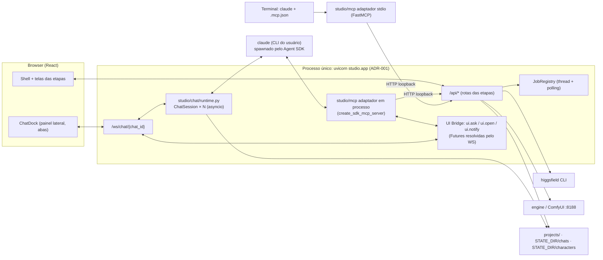

# Plano — Chat Orquestrador: assistente de criação ponta a ponta, MCP do Studio, abas paralelas e identidade de personagem

Task-Id: *(a criar no card do Trello — família `ADH-OS-2026MMDD-NN`)*
Status: **plano** — nada implementado.
Data: 2026-09-05
Base analisada: `develop` em `b3d88ba` (Wave 10 fechada; motor local ADR-033; skill runner ADR-034).
Ambiente alvo: **local, uso pessoal** (MacBook M5 Pro, 24 GB, macOS 26.3). Pontos de escala no §12.

---

## 0. O pedido, reescrito como prompt de planejamento

O pedido original foi refinado abaixo. É este texto que o plano responde, e é ele que deve abrir o
card do Trello e o FDD de cada frente.

> **Contexto.** O Orquestrador Studio é uma ferramenta local (FastAPI + React, single-process,
> sem banco, projetos em `projects/<id>/`) que executa, etapa por etapa, o método de vídeo com IA
> do curso "O Orquestrador". Cada etapa é um plugin (`studio/etapas/<id>/`) com rotas HTTP,
> serviço e tela React. Geração de imagem/vídeo passa por **duas pontes de ferramenta externa**:
> Higgsfield (CLI oficial, pago) e motor local (`engine` + ComfyUI/Flux, grátis). O Claude CLI já
> é usado de duas formas: bot de prompts (`prompter.py`, pergunta curta) e runner de skill
> (`skill_runner.py`, corrida longa com escrita em disco).
>
> **Objetivo.** Adicionar ao Studio um **assistente de chat** que conduz a criação de um conteúdo
> do início ao fim (campanha → referências → mood → base → storyboard → animação → trilha →
> edição → export → publicação), tira dúvidas sobre a aplicação e sobre o método, e **executa
> as ações** das etapas por conversa — sem tirar do usuário a decisão visual (escolher fotos,
> aprovar custo, ajustar máscara, ordenar takes).
>
> **Requisitos funcionais.**
> 1. O modelo é o **Claude Code CLI** do usuário (assinatura, sem chave de API). Nada de
>    `api.anthropic.com` direto.
> 2. As ações do backend ficam expostas como **tools de um servidor MCP** do Studio, usável (a)
>    dentro do chat da aplicação e (b) num terminal `claude` comum. MCP, skills, agentes e
>    prompts de sistema são **código versionado** no repositório.
> 3. O chat interage **visualmente**: mostra imagens/vídeos, pede escolhas e aprovações, e quando
>    a tarefa exige edição fina, abre a tela ou o modal certo da própria aplicação e volta.
> 4. **Abas paralelas**: várias conversas, cada uma ligada a uma campanha, trabalhando ao mesmo
>    tempo; o estado sobrevive a reinício do servidor.
> 5. **Ambos os caminhos de geração continuam**: Higgsfield e ComfyUI, escolhidos por ação.
> 6. Um recurso de **personagem / identidade visual**: acertar o personagem (explorar → escolher →
>    fixar), guardar referências e reaplicar a identidade nas etapas seguintes, em foto e vídeo,
>    tanto pelo caminho pago (Soul ID / referências de imagem) quanto pelo local (IPAdapter/Redux).
> 7. O chat responde "o que falta", "por que esta etapa está bloqueada", "quanto vai custar",
>    "como a aula faz isso" — lendo o guia por etapa (`guide.py`) e a documentação do repositório.
>
> **Restrições arquiteturais vigentes.** ADR-001 (single-process, loopback, sem auth), ADR-003
> (arquivos, sem banco), ADR-004 (fidelidade ao curso: capacidade nova é `[extensão]` + ADR),
> ADR-006 (jobs em thread + polling, um job por projeto), ADR-008 (testes sem rede/navegador),
> ADR-010/032 (núcleo intocável por frente de etapa; titularidade declarada), ADR-016
> (livro-caixa de créditos e cost-confirm para tudo que é pago), ADR-002/033 (pontes só via CLI
> oficial / motor local como segunda ponte), ADR-034 (dois runners do Claude CLI; um terceiro modo
> exige revisitar a decisão).
>
> **Entregável do planejamento.** Um plano que (a) decida a arquitetura do runtime de chat, do
> MCP e do protocolo de interação visual; (b) liste tecnologias e versões; (c) corte o trabalho
> em ondas com frentes paralelizáveis, arquivos tocados, testes e critérios de aceite; (d) registre
> riscos, decisões que viram ADR e o que fica para escalar depois; (e) preencha as lacunas que o
> pedido não enunciou (persistência, custo, concorrência, segurança do agente, observabilidade,
> conhecimento para tirar dúvidas, QA).

---

## 1. Resumo executivo (a decisão em uma página)

| Tema | Decisão | Por quê |
|---|---|---|
| Runtime do chat | **Claude Agent SDK (Python, `claude-agent-sdk` 0.2.x)** rodando **dentro do processo do Studio** (asyncio do FastAPI), um cliente por aba. O SDK sobe o CLI `claude` do usuário por baixo — mesma assinatura, mesma auth. | É o terceiro modo de chamar o Claude (ADR-034 previu). Streaming, `resume`, MCP em processo, callback de permissão e hooks vêm prontos; um subprocess `--input-format stream-json` à mão reimplementaria tudo isso. Mantém ADR-001 (nenhum segundo servidor). |
| Onde as tools vivem | **Servidor MCP "studio"** implementado uma vez como catálogo de funções Python (`studio/mcp/`), com **dois adaptadores**: em processo (SDK, para o chat da app) e `stdio` (FastMCP, para o terminal). As tools falam com o Studio **pela API HTTP em loopback**, nunca importando os serviços. | Os jobs são estado em memória do processo do servidor (ADR-006). Um MCP que importasse `service.py` teria um `JobRegistry` próprio e a tela nunca veria o job. Via HTTP há uma única fonte de estado, o guia se reconcilia e o cost-confirm/livro-caixa (ADR-016) valem por construção. |
| Interação visual | **Híbrida, "o chat conduz, a tela decide"**: (1) cartões ricos no chat para decisões rápidas (escolher 1 de 4, aprovar custo, ver progresso); (2) tools `ui.ask` / `ui.open` que **pausam o turno** do agente e abrem um widget no chat ou um modal/tela existente da aplicação; (3) o chat é um **painel lateral acoplado ao shell**, então a tela principal segue livre para edição pesada (máscara, timeline). | Reescrever máscara/timeline dentro do chat seria duplicar telas prontas e contrariar ADR-010. Um protocolo de "pergunta ao humano" cobre 90% das decisões; para o resto, deep-link + retorno. |
| Abas | Uma aba = uma **sessão de chat** com `session_id` do Claude, `pid` opcional e transcript JSONL em `STATE_DIR/chats/`. Máximo de processos simultâneos configurável (default 3). | Paralelismo real acontece entre **campanhas diferentes**; a mesma campanha só tem um job por vez (ADR-006) — o chat sabe disso e avisa. |
| Personagem | Nova **área global "Personagens"** (padrão ADR-013): explorar → escolher → fixar → gerar character sheet → vincular provedores (Soul ID; IPAdapter/Redux locais) → aplicar na campanha (injeta descritor + referências nas etapas 3–5) + **nota de identidade** (similaridade facial local). | O laboratório `personagem-anime-lab` já provou o fluxo à mão; falta torná-lo produto e ligá-lo às etapas. Tudo `[extensão]` + ADR. |
| Conhecimento para dúvidas | Prompt de sistema versionado + **pacote de conhecimento** gerado dos `guide.py`, FDDs, README e HLDs, exposto como **MCP resources** (`studio://help/...`) e skill `studio-ajuda`. | O agente responde com a fonte de verdade do repositório, sem inventar método (ADR-004). |
| Segurança do agente | O CLI roda com **tools nativas desligadas** (`--tools ""` + só MCP), `--strict-mcp-config`, permissões decididas pelo host (`can_use_tool` → prompt no chat). Ação paga só passa com `ui.confirm_cost`. | Ferramenta pessoal, mas um agente com `Bash` solto na máquina é superfície demais. O que ele pode fazer é exatamente o catálogo do MCP. |

Ordem de entrega: **A (fundação) → B (ações + protocolo humano) → C (abas, persistência, visual) →
D (personagem) → E (conhecimento, QA, MCP no terminal)**. A partir da onda B já dá para usar.

---

## 2. O que já existe e é reaproveitado (verificado no código)

| Peça | Onde | Reuso no plano |
|---|---|---|
| API HTTP completa (212 rotas, OpenAPI publicado) | `studio/app.py` + `studio/etapas/*/router.py`; contrato em `frontend/openapi.json` | Base de **todas** as tools do MCP; guarda de drift entre catálogo de tools e OpenAPI |
| Guia por etapa (status, `missing`, `next_action`, checks) | `studio/common/guide.py`, `etapas/<id>/guide.py`, `GET /api/projects/{pid}/guide[/step]` | Cérebro do "o que falta / próximo passo" do chat; o agente **nunca** calcula prontidão |
| Jobs longos + polling | `studio/common/jobs.py` (um por `pid`), rotas `.../job` | Tool `studio.job_wait` faz o polling e devolve resultado + log; o painel reflete `ProgressModal` |
| Bot de prompts (`mood`, `base`, `motion`, `script`) | `studio/common/prompter.py` + rotas `.../prompts/generate` | O chat **pede prompts pelas rotas**, preservando o padrão do instrutor (ADR-004) |
| Runner de skill (`claude -p`, cwd raiz, tools amplas) | `studio/common/skill_runner.py` (ADR-034) | Fica intocado; o novo runtime é o **terceiro modo** e consolida a decisão em ADR novo |
| Ponte Higgsfield (`cost`, `generate`, histórico, `require_cli`) | `studio/higgsfield.py` (ADR-002/028) | Tools pagas passam pelas rotas `cost`+`generate`; `soul-id` entra pela ponte (função nova) |
| Ponte motor local (`engine image`, inpaint ComfyUI, health 409) | `studio/localengine.py` + `storyboard/local.py` (ADR-033) | Tools `storyboard.local_*`; a biblioteca de personagem reusa a mesma ponte |
| Livro-caixa e modelo default por ação | `studio/common/settings.py` (ADR-016), tela Créditos | Tool `creditos.*`; orçamento por campanha no chat |
| Shell React, contrato de plugin, áreas globais | `frontend/src/shell/*`, `areas/{moodboards,creditos}` | O painel de chat e a área Personagens seguem o padrão de área global |
| Design system (Modal, ProgressModal, CostSheet, MoodMosaic, Tile, Chip…) | `frontend/src/ui/` | Cartões do chat são compostos com esses componentes — nenhum CSS novo no núcleo além do dock |
| Skills e agentes existentes | `.claude/skills/{mood_*,fluxo-video,kling…}`, `.claude/agents/*` | Chamáveis pelo chat via tool `Skill` quando fizer sentido (cadeia de mood, roteiro) |
| Laboratório de personagem | `../personagem-anime-lab/` (150 imagens, TOP 15, runbook Kling) | Vira o fluxo "explorar → fixar" da área Personagens |
| Motores locais | `engine` (Flux schnell/dev GGUF, Redux, presets 1:1/9:16/16:9/4:5), `anime` (Illustrious XL + IPAdapter face — **não instalado nesta máquina, pesos presentes**), ComfyUI 0.34 com GGUF + IPAdapter_plus, RealESRGAN anime, Wan 2.2 ti2v 5B, LTX 2B | Identidade local: Redux (clima) e IPAdapter face (anime); i2v local fica como extensão futura |
| Claude Code CLI 2.1.261 | `--print`, `--output-format stream-json`, `--input-format stream-json`, `--resume`, `--session-id`, `--mcp-config`, `--strict-mcp-config`, `--tools`, `--permission-prompts host`, `--json-schema`, `--max-budget-usd` | Tudo o que o SDK precisa está no binário instalado |
| SDK / libs disponíveis | `claude-agent-sdk` 0.2.152 (PyPI), `mcp` 2.1.1 (FastMCP) | Dependências novas do runtime e do adaptador stdio |

---

## 3. Viabilidade do MCP encapsulando o backend — análise

**Viável, e é o desenho certo.** Três conclusões da análise:

1. **Encapsular pela API, não pelos serviços.** O estado dos jobs vive em memória do processo do
   servidor (ADR-006). Um servidor MCP separado que importasse `studio.<etapa>.service` teria
   `JobRegistry` próprio: a tela não veria o job, o guia não reconciliaria e o cost-confirm da UI
   seria contornado. Tools que chamam `http://127.0.0.1:8765/api/...` resolvem isso de graça e
   servem igualmente ao chat embutido e ao terminal.
2. **212 rotas não viram 212 tools.** Contexto de tool é caro em toda sessão (o próprio README do
   `local_ai_engine` registra isso). O catálogo é **curado**: ~45 tools de alto nível por domínio,
   mais 4 tools transversais (`studio.guide`, `studio.job_wait`, `studio.doctor`, `studio.api`
   — esta última é um escape hatch **somente GET** por allowlist). O que não virou tool continua
   acessível pela tela.
3. **Fidelidade por construção.** Como o chat só age pelas rotas, ele obedece às mesmas regras
   das telas: gate de login 409, cost 422/409, `require_cli`, prompts pelo bot do curso, um job
   por projeto. Não há caminho alternativo para "inventar método" (ADR-004).

Limites conhecidos, já endereçados no plano: `ui.*` só existe no adaptador em processo (no
terminal o agente pergunta em texto); ações que precisam de arquivo do usuário (upload) usam
caminhos locais que a tool envia como multipart; a mesma campanha não tem duas gerações
simultâneas.

---

## 4. Arquitetura

### 4.1 Visão geral



### 4.2 Runtime do chat (`studio/chat/`)

- **`runtime.py`** — `ChatSession`: cria um `ClaudeSDKClient` (Agent SDK) com opções fixas do
  Studio: `system_prompt` (arquivo versionado), `mcp_servers={"studio": <em processo>}`,
  `allowed_tools=["mcp__studio__*"]`, tools nativas **desligadas** (`tools=[]`), `permission_mode`
  padrão `default` com `can_use_tool` → pergunta ao humano pelo chat, `resume=<session_id>` quando
  a aba já existe, `cwd=ROOT`, `setting_sources=[]` (não herda config do usuário; `--strict-mcp-config`).
  Um `asyncio.Task` por aba consome o stream do SDK e publica eventos no WebSocket.
- **`sessions.py`** — registro das abas: `chats.json` em `STATE_DIR/chats/` com
  `{chat_id, title, pid, claude_session_id, created, updated, status}`; transcript por aba em
  `STATE_DIR/chats/<chat_id>/events.jsonl` (cada evento do stream: texto, tool_use, tool_result,
  pergunta/resposta humana, custo). Escrita atômica (`common/atomic.py`).
- **`router.py`** — rotas REST (`GET/POST/PATCH/DELETE /api/chats`, `POST /api/chats/{id}/stop`)
  e o WebSocket `/ws/chat/{chat_id}` (mensagens do usuário, respostas de `ui.ask`, cancelamento;
  eventos de saída: `assistant_delta`, `tool_call`, `tool_result`, `ask`, `open`, `notify`,
  `turn_done`, `error`). Registrado no `app.py` como área global (titularidade de núcleo).
- **`uibridge.py`** — mapa `ask_id → asyncio.Future`. As tools `ui.*` criam a Future, emitem o
  evento no WS e aguardam; a resposta do browser resolve. Timeout configurável (default 30 min);
  ao expirar, a tool devolve `{"answered": false}` e o agente pergunta de novo em texto.
- **`prompts/sistema.md`** — persona (assistente do Orquestrador), regras: seguir o guia, nunca
  gerar pago sem `ui.confirm_cost`, sempre explicar "o que a aula manda" antes de agir, preferir
  o caminho grátis na exploração e o pago na versão final, nunca escolher imagem no lugar do
  usuário. **`prompts/etapas/<id>.md`** — cartão por etapa (o que a aula faz, entradas, saídas,
  armadilhas), derivado dos `guide.py`/FDDs por script (`scripts/build_chat_knowledge.py`) e
  **commitado** (guarda de drift no CI, como o `schema.ts`).
- **Limites**: `STUDIO_CHAT_MAX_ACTIVE` (3), `STUDIO_CHAT_MODEL` (default do CLI do usuário),
  `STUDIO_CHAT_MAX_TURNS` (opcional), `STUDIO_CHAT_BUDGET_USD` (só informativo com assinatura).

### 4.3 Servidor MCP do Studio (`studio/mcp/`)

Estrutura:

```
studio/mcp/
  catalog.py          registro @tool(name, schema, paid=bool, in_app_only=bool) + manifesto
  client.py           httpx sync/async para STUDIO_URL (default http://127.0.0.1:8765)
  tools/
    core.py           studio.projects_list/create/get/patch, studio.guide, studio.job_wait,
                      studio.doctor, studio.reset_step (confirmação), studio.api (GET allowlist)
    refs.py           refs.suggest_terms, refs.search, refs.candidates, refs.import_url/upload, refs.select
    mood.py           mood.prompts_generate, mood.candidates, mood.cost, mood.generate, mood.select,
                      mood.pull_board, moodboards.list/get, moodboards.mood_run(+estimate)
    base.py           base.prompts_generate, base.brand_image, base.cost, base.generate, base.select
    storyboard.py     storyboard.instructions, .generate (pago), .local_generate, .local_inpaint,
                      .script_generate, .scenes_get/put, .angles_* (base, prompts, generate, upscale, select)
    animate.py        animate.shots, .prompt, .takes_add, .like, .cost, .generate
    music.py          music.candidates, .generate, .select, .beats
    edit.py           edit.timeline_get/put, .propose_cuts, .captions_generate, .render
    export.py         export.status, .render, .thumb, .qa, .reframe
    publish.py        publish.log_add/list, .portfolio
    prospect.py       prospect.leads, .teaser, .pitch
    creditos.py       creditos.balance, .cost, .history, .defaults_get/set
    characters.py     character.list/get/create, .explore, .lock, .sheet, .bind_soul, .apply, .score
    ui.py             ui.ask (choose_images | choose_one | confirm | form), ui.confirm_cost,
                      ui.open (etapa/modal com parâmetros), ui.notify, ui.show (galeria/vídeo)
  adapter_sdk.py      create_sdk_mcp_server(name="studio", tools=catalog) — usado pelo chat
  adapter_stdio.py    FastMCP("studio") expondo o mesmo catálogo menos in_app_only — `python -m studio.mcp`
  resources.py        studio://help/<etapa>, studio://project/<pid>/guide, studio://docs/<slug>
  manifest.json       gerado: nome, schema, rota(s) HTTP que a tool usa, paid, in_app_only
```

Regras do catálogo:

- Cada tool declara **as rotas que consome**; um teste cruza `manifest.json` com
  `frontend/openapi.json` e falha se a rota sumiu ou mudou o método (guarda de drift).
- Tool `paid=True` só executa se receber `confirm_token` emitido por `ui.confirm_cost` (que por
  sua vez chamou a rota `cost`). No terminal (sem `ui.*`), a tool paga exige `confirm=true`
  explícito passado pelo agente após perguntar em texto.
- Respostas são **compactas**: ids, thumbs (`/files/...`), contagens, `next_action` do guia —
  nunca o JSON bruto de 50 candidatos. Há `page`/`limit` onde a lista pode crescer.
- Erros HTTP viram texto útil (`409: faça login no Higgsfield…`), nunca stack.

### 4.4 Protocolo humano-no-laço (o "modal" do chat)

| Tool | O que o painel mostra | Retorno para o agente |
|---|---|---|
| `ui.ask(kind="choose_images", images=[{id,thumb,label}], min, max, title)` | grade `MoodMosaic`/`Tile` com seleção, ordenação opcional | `{selected:[ids], order:[...]}` |
| `ui.ask(kind="choose_one", options=[...])` | botões/radio | `{choice}` |
| `ui.ask(kind="form", fields=[...])` | formulário curto (nome, produto, formato) | `{values}` |
| `ui.confirm_cost(action, model, params)` | `CostSheet` com créditos, saldo e modelo (dados da rota `cost`) | `{confirm_token}` ou `{declined:true}` |
| `ui.open(target="storyboard", modal="mask-editor", params={candidate})` | navega para a tela, abre o modal; ao fechar, o modal emite `ui.done` | `{done:true, result:{...}}` |
| `ui.show(media=[...])` | cartão de mídia (imagem, vídeo com player, antes/depois) | `{shown:true}` |
| `ui.notify(text, kind)` | toast + badge na aba | `{}` |

O contrato `ui.open → ui.done` exige que as telas alvo aceitem **parâmetros de abertura por
hash/estado** (`#/<pid>/storyboard?modal=mask&cand=…`) e publiquem um evento de conclusão; é uma
mudança pequena e opt-in por tela (as que não implementarem apenas abrem, e o agente pede ao
usuário para avisar quando terminar).

### 4.5 Frontend (`frontend/src/areas/chat/` + dock no shell)

- **`ChatDock.tsx`**: painel lateral direito redimensionável/colapsável (atalho `⌘J`), sempre
  montado no `Shell` (fora do content-root), com **barra de abas** (`ChatTabs.tsx`): nova aba,
  renomear, fechar/arquivar, badge de não-lido e chip da campanha vinculada.
- **`ChatView.tsx`**: lista virtualizada de mensagens; **`MessageMarkdown.tsx`** (react-markdown +
  remark-gfm); **cartões** por tipo de evento: `ToolCallCard` (nome, args resumidos, estado,
  expansível), `AskCard` (widgets do §4.4), `CostCard`, `MediaCard`, `JobCard` (progresso do
  `job_wait`), `OpenCard` (link para a tela + estado "aguardando você").
- **`useChatSocket.ts`**: WS com reconexão e replay a partir do último `seq`; **`useChats.ts`**
  (TanStack Query) para a lista de abas.
- **Composer**: texto, anexos por arrastar (imagem → tool `*.import_upload` via REST antes de
  enviar a mensagem, o chat recebe só o id), botões rápidos vindos do guia ("Próxima ação",
  "O que falta?", "Custo desta etapa").
- **Contexto da tela**: ao enviar mensagem, o dock anexa `{pid, view, sub}` atuais como
  metadata → o agente sabe "onde" o usuário está.
- Reuso do design system: nenhum componente novo de base; classes novas do dock vão para o
  catálogo do shell (contrato §5 do `shell-redesign-fdd.md`).

### 4.6 Área global Personagens (`studio/characters/` + `frontend/src/areas/characters/`)

Armazenamento `STUDIO_CHARACTERS` (default `<ROOT>/characters/`, gitignored; env lida no módulo,
não em `config.py`):

```
characters/<cid>/
  character.json     nome, descritor canônico EN (bloco de prompt), negativos, estilo (foto|anime|3d),
                     locked_ref, sheet[], providers{higgsfield:{soul_id, soul_variant, image_refs[]},
                     local:{ipadapter_refs[], redux_ref, strength}}, created/updated
  refs/              fotos de referência importadas pelo usuário
  explore/<lote>/    lab: NN_<slug>/{imagem.png, meta.json} + contact_sheet.jpg (proveniência completa)
  sheet/             character sheet gerado: front, 3/4, profile, full-body, 3 expressões
  scores.json        nota de identidade por imagem (opcional)
```

Fluxos:

1. **Explorar** (`character.explore`): brief + estilo + N variações → lote no motor local
   (`engine image`, seed fixa por índice, `flux-schnell` 6–8 steps) → folha de contato → `ui.ask
   choose_images` → o escolhido é re-renderizado em `flux-dev` 24 steps **mesma seed**.
2. **Fixar** (`character.lock`): grava `locked_ref`, gera o **descritor canônico** via prompter
   (papel novo `character`, `[extensão]`: descreve rosto, cabelo, roupa, paleta, traços que não
   podem mudar) e o **character sheet** (`character.sheet`): 6 vistas geradas com a mesma seed
   base + Redux (`engine mood --ref locked --strength 0.3`) e, no estilo anime, `anime personagem
   --ref` (IPAdapter face). O usuário aprova a folha (`ui.ask`).
3. **Vincular provedores**: `character.bind_soul` → `higgsfield soul-id create --name --soul-2|
   --soul-cinematic --image sheet/*` (função nova em `higgsfield.py`, `[extensão]`, exige plano
   Basic+ — o gate 409 já cobre); `image_refs` = até 14 imagens para `nano_banana_2`.
4. **Aplicar na campanha** (`character.apply(pid, cid)`): grava `project.json.character = cid`
   `[extensão]` e passa a injetar automaticamente: bloco de descritor nos prompts de base/
   storyboard/ângulos/animação (via campo aditivo `character_block` nas rotas de prompt), refs de
   imagem nas gerações pagas (`image_references`), `--soul-id` nos modelos que aceitam, `--ref`
   no motor local. Nada muda para campanha sem personagem.
5. **Nota de identidade** (`character.score`): similaridade facial (ArcFace via `insightface`)
   entre `locked_ref` e candidatas → chip "identidade 0.82" nas galerias e ordenação. Implementar
   como comando do **`local_ai_engine`** (`engine faces compare`) para não puxar torch para o
   venv do Studio (mesmo espírito da ADR-033); o Studio só chama por subprocess.

Vídeo: identidade em movimento vem do keyframe (i2v mantém a start-image) e do `--soul-id` nos
modelos `soul_cinematic`/`text2image_soul_v2`; regra prática que o chat ensina: acertar o
personagem na imagem antes de animar.

---

## 5. Tecnologias e versões

| Camada | Tecnologia | Versão / nota |
|---|---|---|
| Backend | Python 3.12, FastAPI + Starlette WebSocket, Uvicorn | já no repo |
| Runtime do agente | `claude-agent-sdk` | 0.2.152 (PyPI); spawna o CLI `claude` 2.1.x instalado; auth pela assinatura |
| MCP standalone | `mcp` (FastMCP) | 2.1.1; transporte stdio; registrado em `.mcp.json` do repo |
| HTTP interno | `httpx` | já em `requirements-dev.txt`; passa para `requirements.txt` |
| Persistência | JSONL + JSON atômico em `STATE_DIR/chats/`, `characters/` | ADR-003 mantido |
| Frontend | React 19, TypeScript estrito, Vite 7, TanStack Query 5, Vitest 3 | já no repo |
| Markdown no chat | `react-markdown` + `remark-gfm` | novos; ~40 KB gz |
| Lista virtual | `@tanstack/react-virtual` | novo; opcional na onda C |
| Geração paga | Higgsfield CLI 1.1.24 (`generate`, `soul-id`, `model list`) | ADR-002 |
| Geração local | `engine` (Flux schnell/dev GGUF, Redux), `anime` (Illustrious XL + IPAdapter face, a instalar), ComfyUI 0.34 | ADR-033 |
| Identidade | `insightface` + `onnxruntime` (no `local_ai_engine`) | novo comando `engine faces` |
| Testes | pytest (fake do SDK e do CLI), Vitest/RTL, Playwright (cenários QA) | ADR-008 |
| Docs | FDD por frente, ADRs novos, diagramas Mermaid | fluxo `/dd` |

Decisões de descarte: **Node/TypeScript Agent SDK** (traria segundo runtime — ADR-001);
**API key** (o pedido é assinatura via CLI; o SDK permite trocar depois — §12); **LangGraph/
framework de agentes** (o CLI já é o agente; o Studio só dá tools e UI); **gerar tools do
OpenAPI automaticamente** (explode contexto; catálogo curado com guarda de drift).

---

## 6. Ondas de entrega

Cada onda segue o `/dd`: card no Trello, recon, FDD, implementação, `make verify` + `make
frontend-verify`, QA, doc-sync, ADR. Frentes marcadas ∥ podem rodar em worktrees paralelas
(`/dd-parallel`), respeitando a titularidade de núcleo.

### Onda A — Fundação (1 semana)

**A0 · Spikes (bloqueantes, 1 dia)**
- S1: `claude-agent-sdk` autentica com a assinatura do CLI em modo não-interativo dentro do
  uvicorn? (esperado: sim, usa o login do `claude`). Medir memória por sessão e tempo do 1º token.
- S2: MCP em processo + `can_use_tool` → prompt de permissão funciona com `tools=[]`?
- S3: `resume` de sessão após reiniciar o servidor mantém contexto?
- S4: `--strict-mcp-config` + `setting_sources=[]` isola das skills/MCPs do usuário (Trello, Context7)?
  Saída: nota em `docs/domains/chat/spikes.md`; se S1 falhar, fallback = subprocess
  `claude -p --input-format stream-json --output-format stream-json` (mesma interface interna).

**A1 · Runtime + WS + painel mínimo** (núcleo: `app.py`, `frontend/src/shell/`)
- `studio/chat/{runtime,sessions,router,uibridge}.py`; uma aba; streaming de texto; parar turno.
- `ChatDock` colapsável com uma conversa; markdown; sem cartões ainda.
- Testes: fake `ClaudeSDKClient` que replica eventos gravados; WS com `TestClient`.

**A2 · MCP catálogo + tools de leitura** ∥
- `studio/mcp/{catalog,client,adapter_sdk,adapter_stdio,resources}.py`; tools `studio.*`,
  leitura de candidatos/guia/creditos por etapa; `studio.doctor`.
- Guarda de drift manifest × OpenAPI; testes com `respx`/fake do client.

**Aceite A**: abrir o painel, perguntar "o que falta na campanha X?" e receber a resposta correta
vinda do guia; `python -m studio.mcp` listado e conectado no `claude mcp list` do terminal.

### Onda B — Ações e humano-no-laço (1,5 semana)

- **B1 · `ui.*` + cartões** (frontend + `uibridge`): `choose_images`, `choose_one`, `form`,
  `confirm_cost`, `show`, `notify`; `JobCard` com progresso do `job_wait`.
- **B2 · Tools de ação, etapas 1–4** ∥ (refs, mood, base, storyboard incl. local e inpaint).
- **B3 · Tools de ação, etapas 5–10** ∥ (animate, music, edit, export, publish, prospect).
- **B4 · Prompt de sistema + cartões por etapa** (`prompts/`, `scripts/build_chat_knowledge.py`,
  guarda de drift) + skill `studio-conduzir` (o mesmo roteiro para uso no terminal).
- **B5 · Gate de custo**: `paid=True` só com `confirm_token`; teste que prova que nenhuma tool
  paga chama `generate` sem token; registro no livro-caixa acontece pela rota (ADR-016).

**Aceite B**: "cria uma campanha para a lata X, acha uma vibe e gera o mood" termina com o usuário
escolhendo as imagens num cartão e aprovando o custo; a tela de mood reflete o resultado sem
reload. Uma campanha inteira (refs → export) é conduzida só pelo chat, com o usuário tomando as
decisões visuais.

### Onda C — Abas, persistência e integração visual (1 semana)

- **C1 · Abas**: N sessões, `chats.json`, arquivar/renomear, badge de não-lido, limite de ativos
  com fila ("aguardando vaga"), reconexão/replay do WS.
- **C2 · Persistência e retomada**: transcript JSONL, `resume` da sessão do Claude, restauração
  das abas no boot; exportar conversa em markdown para `projects/<pid>/chat/`.
- **C3 · `ui.open`/`ui.done`** nas telas que têm modal pesado: Storyboard (MaskEditor, Annotate),
  Edit (timeline), Animate (takes), Mood (seleção) — parâmetros por hash + evento de conclusão.
- **C4 · Contexto de tela e ações rápidas** no composer; atalhos de teclado; tema claro/escuro.

**Aceite C**: duas abas em campanhas diferentes geram ao mesmo tempo (uma Higgsfield, uma local);
reiniciar o Studio e continuar a conversa de onde parou; "abre a máscara da cena 3" leva ao
MaskEditor e, ao salvar, o chat continua sozinho.

### Onda D — Personagem e identidade (1,5 semana)

- **D1 · Área Personagens** (backend + tela): CRUD, refs, explorar (lote + folha de contato +
  re-render HQ), fixar, character sheet, descritor via prompter (papel `character`).
- **D2 · Vínculos**: `soul-id` na ponte Higgsfield (`[extensão]`), `image_references`, motor local
  (Redux e `anime personagem`; instalar o binário `anime` do `local_ai_engine`).
- **D3 · Aplicar na campanha**: `project.json.character`, campo aditivo `character_block` nas
  rotas de prompt/geração das etapas 3–5, chip na topbar.
- **D4 · Nota de identidade**: `engine faces compare` no `local_ai_engine` + tool `character.score`
  + chip nas galerias.
- Tools `character.*` no MCP; skill `studio-personagem` (roteiro do laboratório).

**Aceite D**: partir de um brief, explorar 24 variações, fixar uma, gerar a folha, vincular Soul
ID e gerar 3 cenas do storyboard com a mesma pessoa; a nota de identidade ordena as candidatas.

### Onda E — Conhecimento, QA e acabamento (1 semana)

- **E1 · Pacote de conhecimento**: `docs/manual/<tela>.md` gerado (reusar a ideia da skill
  `docs-uso`), MCP resources `studio://help/*`, skill `studio-ajuda`; o chat cita a fonte.
- **E2 · QA**: cenários Playwright do painel (`scripts/qa/cenarios/chat.py`), fake do SDK no
  `make qa-up`, cenários de `ui.ask`; relatório em `docs/qa/reports/`.
- **E3 · Observabilidade**: log estruturado por sessão (`STATE_DIR/chats/<id>/trace.jsonl`),
  painel "o que o assistente fez" por campanha, contagem de tokens/turnos por aba.
- **E4 · Documentação**: HLD `docs/domains/chat/hld.md`, `docs/domains/characters/hld.md`,
  ADRs (§8), atualização de `CLAUDE.md`/`AGENTS.md`/`README.md`, manual de uso do chat.

---

## 7. Lacunas que o pedido não enunciou — e como o plano as cobre

| Lacuna | Cobertura |
|---|---|
| **Custo e irreversibilidade** | Toda tool paga exige `confirm_token`; orçamento por campanha (`creditos.budget`, chip no dock); reset só com `ui.ask confirm`; exploração sugerida no motor local antes do pago. |
| **Concorrência** | Um job por campanha (ADR-006): o chat detecta 409 e espera/avisa; GPU local serializa pelo ComfyUI (fila natural); limite de sessões ativas; Higgsfield é paralelo de verdade. |
| **Segurança do agente** | Sem `Bash/Write/Edit`; só tools do MCP; `setting_sources=[]` e `--strict-mcp-config`; `studio.api` só GET com allowlist; caminhos de upload restritos a `~/Downloads`, `projects/`, `characters/` e pastas que o usuário escolher. |
| **Persistência/retomada** | Transcript JSONL + `resume`; exportação em markdown; replay de WS. |
| **Falhas do CLI** | Estados `sem claude`, `sem login`, `sessão expirada`, `timeout` viram mensagens no chat com ação (mesmo padrão do gate 409 do Higgsfield); `studio.doctor` no boot do painel. |
| **Fidelidade ao curso** | O chat age só pelas rotas; o prompt de sistema proíbe inventar etapa; extensões marcadas; `[extensão]` visível nos cartões. |
| **Conhecimento** | Guia vivo + pacote gerado dos docs; cita fonte (aula, FDD). |
| **Observabilidade** | Trace por sessão, cartões de tool expansíveis, contagem de uso. |
| **Testes sem rede** | Fake do SDK (eventos gravados), fake do client HTTP do MCP, fakes existentes de `claude`/`higgsfield`; QA com fakes. |
| **Contrato de tools × API** | Guarda de drift manifest × OpenAPI no CI. |
| **Uploads do usuário** | Arrastar no composer → REST multipart → id; o agente nunca lê bytes. |
| **Acessibilidade e atalhos** | `⌘J` abre/fecha, `⌘K` nova aba, `Esc` cancela `ask`; ARIA nos cartões. |
| **Licenças** | Flux dev é não-comercial: o chat avisa e sugere schnell ou Higgsfield para entrega de cliente; imagens do Pinterest só como referência (já documentado). |

---

## 8. Decisões que viram ADR

| ADR | Decisão |
|---|---|
| ADR-036 | Runtime de chat via Claude Agent SDK em processo — terceiro modo de chamar o Claude; consolida `prompter`/`skill_runner`/`chat` sob uma política comum (auth por assinatura, sem API key) |
| ADR-037 | Servidor MCP do Studio como **cliente HTTP** da própria API (nunca importa serviços); catálogo curado com guarda de drift; dois adaptadores |
| ADR-038 | Protocolo humano-no-laço `ui.ask/confirm_cost/open/done` — o agente nunca decide escolha visual nem gasto |
| ADR-039 | Biblioteca global de Personagens e injeção de identidade nas etapas 3–5 (`[extensão]` da ADR-004; estende ADR-013/ADR-033; Soul ID via CLI mantém ADR-002) |
| ADR-040 | Agente sem tools nativas e isolado das configs do usuário (`setting_sources=[]`, `--strict-mcp-config`) |
| Emendas | ADR-001 (WebSocket no mesmo processo; nada de segundo runtime), ADR-010 (novas áreas globais `chat` e `characters` como núcleo com titularidade), ADR-034 (nota "terceiro modo apareceu → ADR-036") |

---

## 9. Riscos e mitigações

| Risco | Prob. | Mitigação |
|---|---|---|
| SDK não autentica com assinatura fora do TTY | baixa | Spike S1 primeiro; fallback subprocess `stream-json` atrás da mesma interface |
| Memória: 3 processos `claude` + ComfyUI em 24 GB | média | Limite de ativos; abas ociosas hibernam (encerra o processo, mantém `session_id`) |
| Contexto inflado por muitas tools | média | Catálogo ≤ 50, descrições curtas, respostas compactas, resources em vez de tools para texto |
| Versão do CLI muda flags/eventos | média | SDK pinado; teste de fumaça manual registrado na PR (ADR-008 já assume isso) |
| `ui.ask` esquecido pelo usuário | alta | Timeout longo + badge; ao expirar o agente re-pergunta; a aba mostra "aguardando você" |
| Deriva entre tools e rotas | média | Guarda de drift no CI |
| Personagem: Soul ID exige plano pago; IPAdapter face é SDXL (anime), não Flux | conhecida | Chat explica as opções por estilo; Flux usa Redux + descritor + refs; PuLID/InstantID ficam como upgrade opcional |
| Limites de uso da assinatura com abas paralelas | média | Contador de turnos por aba; aviso ao usuário; fila |

---

## 10. Critérios de "dá para usar" (aceite global)

1. Campanha nova até `export/` conduzida pelo chat, com todas as escolhas visuais feitas pelo
   usuário em cartões ou telas abertas pelo chat.
2. Nenhum crédito gasto sem `confirm_cost` aceito; o livro-caixa bate com o histórico do chat.
3. Duas abas em campanhas distintas trabalhando ao mesmo tempo; reinício do servidor não perde
   nada.
4. "O que falta na etapa 4?" / "Por que está bloqueada?" / "Como a aula 012 faz a animação?"
   respondidos com fonte.
5. Personagem explorado, fixado e reaplicado em ≥ 3 cenas, foto e vídeo, nos dois caminhos.
6. `claude` no terminal com `.mcp.json` executa as mesmas tools contra o Studio rodando.
7. `make verify`, `make frontend-verify`, guardas de drift e QA do painel verdes.

---

## 11. Estrutura final de arquivos (novos e tocados)

```
studio/chat/            runtime.py sessions.py router.py uibridge.py prompts/{sistema.md,etapas/*.md}
studio/mcp/             catalog.py client.py adapter_sdk.py adapter_stdio.py resources.py manifest.json tools/*.py
studio/characters/      router.py service.py descriptor.py sheet.py
studio/higgsfield.py    (+ soul_id_create/list — núcleo, titularidade)
studio/app.py           (+ include_router chat, characters; WS — núcleo, titularidade)
frontend/src/areas/chat/        ChatDock ChatTabs ChatView cards/* useChatSocket useChats
frontend/src/areas/characters/  CharactersArea Explore Sheet
frontend/src/shell/     Shell.tsx (monta o dock) constants.ts (rotas CH_ROUTE/CHAR_ROUTE) router.ts
.claude/skills/studio-conduzir/  studio-personagem/  studio-ajuda/
.mcp.json               servidor "studio" (stdio) para uso no terminal
scripts/build_chat_knowledge.py  scripts/qa/cenarios/chat.py
tests/test_chat_*.py tests/test_mcp_*.py tests/test_characters_*.py
docs/domains/chat/  docs/domains/characters/  docs/adrs/generated/STUDIO/ADR-036…040
```

---

## 12. Pontos de escala (fora do escopo local, deixados prontos)

- **Multiusuário/rede**: ADR-001 supersede — auth (token) no WS e na API, bind fora do loopback
  atrás de reverse proxy; `chat_id` já é UUID e o transcript já é por sessão.
- **Modelo por API key**: o Agent SDK aceita `ANTHROPIC_API_KEY`; trocar é config, não código.
- **MCP remoto**: o adaptador stdio vira transporte HTTP/SSE do FastMCP sem mudar o catálogo.
- **Estado**: `STATE_DIR/chats` → SQLite/Postgres via camada `sessions.py` (única que grava).
- **Jobs**: `JobRegistry` → fila (RQ/Celery) mantendo as rotas `.../job` como contrato.
- **Mídia**: `projects/` → objeto (S3) atrás de `/files`.
- **Contêiner**: Studio + ComfyUI separados; o motor local já é ponte por HTTP/subprocess.
- **Vários operadores em paralelo**: limite de sessões vira por usuário; GPU vira fila remota.

---

## 13. Próximos passos imediatos

1. Criar o card no Trello (lista `DD · To Do`) com este plano linkado e abrir `/dd-feature` da
   **Onda A** (recon do domínio `studio` + spikes A0).
2. Decidir dois pontos que dependem de preferência do dono do produto (não bloqueiam A0):
   painel lateral vs. página dedicada como default (o plano assume painel); nome público do
   assistente no shell.
3. Após os spikes, congelar a interface interna `ChatRuntime` e disparar A1 ∥ A2.
