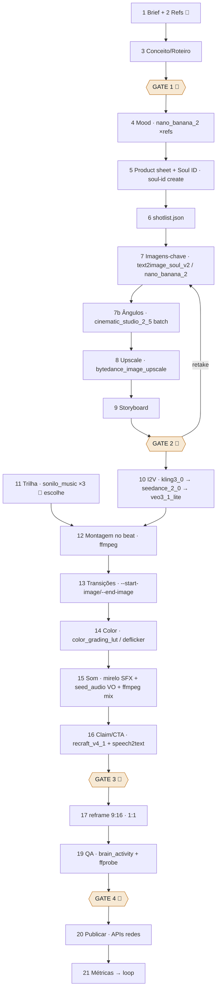

# Plano Total — Pipeline de vídeo 100% sobre Higgsfield (CLI + skills)
### Versão Higgsfield-cêntrica do `PLANO-AUTOMACAO-VIDEOS.md`

> **Base:** método das aulas 009→014 do curso "O Orquestrador — Iniciante" + documentação oficial da Higgsfield verificada em 24/08/2026: [CLI](https://github.com/higgsfield-ai/cli) · [MODELS.md](https://github.com/higgsfield-ai/cli/blob/main/MODELS.md) · [skills](https://github.com/higgsfield-ai/skills) · [help center CLI/MCP](https://higgsfield.ai/creator-hub/help-center/mcp-cli/how-do-i-access-higgsfield-via-cli) · [MCP](https://higgsfield.ai/mcp).
> **Regra da doc oficial:** consultar o catálogo vivo (`higgsfield model list`, `higgsfield workflow list`) — IDs abaixo vêm do `MODELS.md` de hoje e podem mudar. **Não** chamar `api.higgsfield.ai` com curl; sempre pelo CLI.
> Créditos por geração são estimativas de fontes terceiras (ago/2026) — o custo real aparece em `--json` de cada job. **Ilimitado/grátis da UI não se aplica ao CLI/MCP.**

---

## 0. O que muda em relação ao plano anterior

| Antes | Com Higgsfield CLI |
|---|---|
| N2 precisava de Google AI Studio + fal.ai/Kling API + ElevenLabs | **Uma conta, um login** (`higgsfield auth login`, OAuth). Imagem, vídeo, personagem, upscale, música, SFX, VO, legendas, reframe: tudo no mesmo catálogo |
| Multi Shot e Cinema Studio = só UI | `cinematic_studio_3_0` com `multi_shots`, `genre`, `speedramp`; `cinematic_studio_video_3_5` com `camera_style`, `color_grading`, `light_scheme` |
| Transição "último frame → start frame" via ffmpeg + API externa | `--start-image` + `--end-image` nativos em 12 modelos (kling3_0, seedance_2_0, cinematic_studio_3_0, wan2_7, veo3_1_lite, minimax_hailuo…) |
| Personagem consistente por character sheet | `soul-id create` → `--soul-id` (identidade treinada) + `image_references` (até 14 no `nano_banana_2`) |
| Crop 9:16 por ffmpeg | workflow **`reframe`** (reenquadramento inteligente) |
| Upscale local (Real-ESRGAN) | `bytedance_image_upscale` / `topaz_image` para imagens; `topaz_video` / `video_upscale` para vídeo (local continua como opção grátis) |
| Trilha em biblioteca / SFX manual | `sonilo_music` (trilha por prompt + duração), `mirelo_text_to_audio` (SFX), `seed_audio`/`text2speech_v2` (VO), `speech2text` (legendas) |
| QA só humano | `brain_activity` (preditor de engajamento/viralidade) como sinal extra antes do GATE 4 |
| Montagem no CapCut | **ffmpeg continua** para o corte no ritmo (a Higgsfield não tem editor por CLI; `explainer_video` é montador só para o formato explainer) |

O que **continua fora** da Higgsfield: curadoria de referências, os 4 gates humanos, o corte no beat (ffmpeg + librosa), a publicação (APIs do YouTube/Instagram) e a DM de prospecção.

---

## 1. Setup (uma vez)

```bash
# CLI (Linux/WSL) — npm ou curl
npm install -g @higgsfield/cli            # ou: curl -fsSL https://raw.githubusercontent.com/higgsfield-ai/cli/main/install.sh | sh
higgsfield auth login                      # abre OAuth; tokens curtos → repetir quando der erro de sessão
higgsfield model list --json > catalog.json   # catálogo vivo: confirmar IDs e params
higgsfield workflow list                   # espera-se: draw_to_video, reframe

# Skills oficiais dentro do Claude Code (instala /higgsfield:generate, :soul-id, :product-photoshoot, :brandkit …)
npx skills add higgsfield-ai/skills        # ou: /plugin marketplace add higgsfield-ai/skills

# Ferramentas locais que ficam de fora da Higgsfield
sudo apt install ffmpeg
python3 -m venv .venv && . .venv/bin/activate && pip install librosa soundfile
```

**Não** conectar o MCP ao mesmo tempo (a Higgsfield diz que CLI e MCP não coexistem; para Claude Code, recomenda CLI).

**Orçamento**: definir `budget_credits` no `brief.md`. Cada job devolve custo em `--json`; o orquestrador soma em `costs.json` e para quando estourar.

---

## 2. Mapa: método do curso → comando Higgsfield

| Aula | O que o instrutor faz na UI | Equivalente CLI | Executor |
|---|---|---|---|
| 009 | Pinterest / Explore → salvar refs | — (curadoria humana); Claude descreve e agrupa | 🧑 |
| 009 | Bot gera prompt de mood → 4 variações | Claude gera prompt → `generate create nano_banana_2 --prompt … --image-references ref1.jpg ref2.jpg --count 4` | 🤖 |
| 009 | Nano Banana troca rótulo da lata | `generate create nano_banana_2 --image-references base.png logo.svg --prompt "Replace the can label with the provided logo…"` | 🤖 |
| 009 | Upscale 2x High Fidelity | `generate create bytedance_image_upscale --image-references shot_final.png` (ou Real-ESRGAN local) | 🤖 |
| 010 | Draw to Edit (desenha alpinista) | `generate workflow draw_to_video --video base.mp4 --sketch sketch.png` **ou** descrever composição para `nano_banana_2` | 🤝 (você desenha) |
| 010 | Edições uma por vez | `nano_banana_2` com 1 instrução por chamada, `--image-references anterior.png` | 🤖 |
| 010/011 | Multi Shot (vários ângulos da cena) | `generate create cinematic_studio_2_5 --image-references base.png --prompt "same scene, {ângulo}" --batch_size 4` **ou** N chamadas `nano_banana_2` com o ângulo do shotlist | 🤖 |
| 011 | Abrahub Cinema Studio (realismo, RED, Dutch, ultra-wide) | `cinematic_studio_video_3_5 --camera_style … --color_grading … --light_scheme … --genre …` para vídeo; para still, `cinematic_studio_2_5` + bloco de câmera no prompt | 🤖 |
| 011 | Personagem sem rosto / consistência | `soul-id create --name astro --image sheet_*.png` → `text2image_soul_v2 --soul-id <id>` | 🤖 |
| 012 | Kling 2.6 image-to-video | `generate create kling3_0 --start-image shot.png --prompt … --duration 5 --mode pro --aspect_ratio 16:9 --wait --json` | 🤖 |
| 012 | Kling 2.5 Turbo start/end frame | `kling3_0 --start-image a.png --end-image b.png` (ou `seedance_2_0`) | 🤖 |
| 012 | "3–4 falhas → troca modelo" | política de retry: kling3_0 → seedance_2_0 → veo3_1_lite → wan2_7 | 🤖 |
| 012 | Áudio do modelo OFF | `--sound false` / não passar `generate_audio` | 🤖 |
| 013 | Escolher trilha "sentindo" | 3 candidatas: `sonilo_music --prompt "{mood}, {bpm} bpm, no vocals" --duration 35` → você escolhe | 🤝 |
| 013 | Cena extra do produto (geladeira) | `nano_banana_2 --image-references ref_geladeira.jpg product_hero.png --prompt "Replace the can in image 1 with the can from image 2…"` | 🤖 |
| 014 | Último frame → start frame da próxima | `ffmpeg -sseof -0.05 …` → `kling3_0 --start-image last.png --end-image next.png` | 🤖 |
| 014 | Corte no ritmo, speed ramp, pretos, fade | ffmpeg + `beats.json` (librosa) — ou `cinematic_studio_3_0 --speedramp` quando a cena inteira nasce como multi-shot | 🤖 → GATE 3 |
| 014 | SFX "de formiguinha" | `mirelo_text_to_audio --prompt "astronaut breathing inside helmet" --duration 6` por item de `sfx[]` | 🤖 |
| 014 | Exportar vertical | `generate workflow reframe` (9:16, 1:1) | 🤖 |
| 014 | Publicar | fora da Higgsfield (APIs das redes) | 🤝 |
| 001 | Teaser 5–10 s com música para DM | pipeline reduzido: 1 shot → `kling3_0 5s` → `sonilo_music 8s` → ffmpeg | 🤖 / 🧑 envia |

---

## 3. Pipeline completo (22 estágios) com comandos

Legenda: 🤖 automático · 🤝 Claude gera, humano aprova · 🧑 humano. Créditos ≈ (fontes terceiras; confirmar no `--json`).

| # | Estágio | Comando(s) Higgsfield / local | Executor | Aceite | ≈ créditos |
|---|---|---|---|---|---|
| 0 | Bootstrap | `mkdir -p` árvore §5; `higgsfield auth login`; `model list --json` | 🤖 | catálogo salvo; IDs do shotlist existem no catálogo | 0 |
| 1 | Briefing | Claude entrevista → `brief.md` (inclui `budget_credits`) | 🤝 | campos obrigatórios | 0 |
| 2 | Referências | Pinterest/Explore → `refs/brainstorming/`; Claude gera `refs/README.md` | 🧑 | ≥ 8 refs | 0 |
| 3 | Conceito + roteiro | Claude → `concept.md`, `script.md` | 🤖 → **GATE 1** | big idea; 5 cenas; claim/CTA | 0 |
| 4 | Mood board | `nano_banana_2 --image-references refs/*.jpg --prompt "<mood>" --count 4 --resolution 1k` ×2 prompts → `mood/`; `palette.json` extraído por Python | 🤖 · 🧑 escolhe | paleta consistente | 8×2 = 16 |
| 5a | Product sheet | `nano_banana_2 --image-references assets/brand/logo.png --prompt "packshot of energy can with this logo, studio light, neutral gray, 3 views" --resolution 2k` | 🤖 · 🧑 aprova | rótulo correto | 4 |
| 5b | Character (Soul ID) | `nano_banana_2` → 3–5 vistas do personagem → `higgsfield soul-id create --name astro --image sheet_01.png --image sheet_02.png …` → `reference_id` em `assets/soul.json` | 🤖 · 🧑 aprova | Soul treinado | ~10 + custo do soul-id |
| 6 | Decupagem | Claude → `shotlist.json` (§5) | 🤖 | schema válido; hook ≤ 3 s; Σ durações ≈ alvo | 0 |
| 7 | Imagens-chave | por shot: `text2image_soul_v2 --soul-id <id> --image-references mood/mood_03.png --prompt "<prompt_img>" --aspect_ratio 16:9 --quality 2k --count 3` (sem personagem: `nano_banana_2` com refs de mood + product) | 🤖 · 🧑 marca `_final` | consistente com sheet/mood | 8 shots × 3 × 2 ≈ 48 |
| 7b | Ângulos extras (Multi Shot) | `cinematic_studio_2_5 --image-references shot_final.png --prompt "same scene and lighting, new camera: {scale} {angle} {lens}mm" --batch_size 4` | 🤖 | continuidade | 4–8 por cena |
| 8 | Upscale | `bytedance_image_upscale --image-references shotM_final.png` (ou Real-ESRGAN local, 0 créditos) | 🤖 | ≥ 2K | ~2 por imagem ou 0 |
| 9 | Storyboard | Claude → `storyboard.html` | 🤖 → **GATE 2** | ordem/cores aprovadas | 0 |
| 10 | Image-to-video | por shot: `kling3_0 --start-image shotM_final_2x.png --prompt "<prompt_motion>" --duration 5 --mode pro --aspect_ratio 16:9 --sound false --wait --json` ×2 takes; se `end_frame_from` → `--end-image`; retry: `seedance_2_0 --mode std --resolution 720p` → `veo3_1_lite` | 🤖 · 🧑 "like" | movimento pedido; sem artefato grave | Kling ≈7×2×8 = 112 (Seedance ≈25×… se usado) |
| 10b | Cena inteira multi-shot (opcional) | `cinematic_studio_3_0 --image-references cena_base.png --prompt "<beat da cena>" --multi_shots 3 --duration 10 --genre commercial --speedramp true --resolution 1080p` | 🤖 | substitui 7b+10 para cenas simples | [VERIFICAR custo] |
| 11 | Trilha | `sonilo_music --prompt "cinematic trailer, icy synth, {bpm} bpm, building impact, no vocals" --duration 35` ×3 → você escolhe → `librosa` → `beats.json` | 🤝 | beats detectados | ~3×? |
| 12 | Montagem no ritmo | ffmpeg: trims em `impacts[]`, `minterpolate` p/ speed ramp, quadros pretos, concat | 🤖 → **GATE 3** | cortes ± 2 frames dos impactos | 0 |
| 13 | Transições coladas | `ffmpeg -sseof -0.05 -i A.mp4 -frames:v 1 A_last.png` → `kling3_0 --start-image A_last.png --end-image B_first.png --duration 5` | 🤖 | sem salto | ≈7 cada |
| 14 | Color / deflicker | `color_grading_lut --video rough_cut.mp4 …` [VERIFICAR params] e `video_deflicker`; fallback ffmpeg `eq`/LUT | 🤖 | takes casam | ? |
| 15 | Som | SFX: `mirelo_text_to_audio --prompt "<sfx>" --duration N` por item; VO (se houver): `text2speech_v2 --variant elevenlabs --voice_id …` ou `seed_audio`; mix ffmpeg `amix` + `loudnorm=I=-14` | 🤖 · 🧑 aprova VO | -14 LUFS; SFX nos eventos | ~1–3 cada |
| 16 | Claim/CTA/legendas | end card: `recraft_v4_1 --model_type vector` (ou SVG local); legendas: `speech2text` se houver VO → `.srt` → ffmpeg `subtitles` | 🤖 | marca; safe areas | ~2 |
| 17 | Variantes | `generate workflow reframe --video master.mp4 --aspect_ratio 9:16` e `1:1`; thumb por ffmpeg | 🤖 | POI preservado | ? |
| 18 | Upscale final (opcional) | `topaz_video` / `video_upscale --video master.mp4` | 🤖 | 4K sem artefato | [VERIFICAR] |
| 19 | QA | ffprobe + checklist + `brain_activity --video export/9x16.mp4 --json` | 🤖 → **GATE 4** | zero bloqueantes; score registrado | ? |
| 20 | Publicação | YouTube Data API / Instagram Graph (fora da Higgsfield) | 🤝 | post ao vivo | 0 |
| 21 | Métricas / loop | APIs das redes → `metrics.json`; comparar com `brain_activity` | 🤖 | — | 0 |

**Estimativa por comercial de 30–45 s (8 shots, 2 takes, Kling 3.0 720p):** ≈ 250–400 créditos (≈ US$12–20 no plano de 1.000 créditos/US$49). Com Seedance 2.0 1080p em todos os takes, o vídeo sobe para ≈ 800+ créditos — por isso a política de retry começa no Kling.

---

## 4. Diagrama



---

## 5. Estrutura, schema e orquestrador

Árvore igual ao plano anterior, com dois arquivos novos:

```
projetos/2026-08-gelo-zero/
├── brief.md · concept.md · script.md · shotlist.json
├── catalog.json            # higgsfield model list --json (data da execução)
├── assets/ brand/, product_hero.png, sheet_01..05.png, soul.json {"reference_id": "…"}
├── mood/ · images/cenaNN/ · videos/cenaNN/ · audio/ · edit/ · export/
├── jobs/                   # 1 JSON por job Higgsfield (id, modelo, params, custo, url, arquivo local)
├── costs.json · credits.json · qa_report.md · storyboard.html
```

**Campos novos no `shotlist.json`** (além dos anteriores):

```json
"model_img": "text2image_soul_v2",     // ou nano_banana_2 / cinematic_studio_2_5
"soul_id": "assets/soul.json",
"image_references": ["mood/mood_03.png", "assets/product_hero.png"],
"model_video": ["kling3_0", "seedance_2_0", "veo3_1_lite"],   // ordem de retry
"video_params": {"duration": 5, "mode": "pro", "aspect_ratio": "16:9", "sound": false},
"end_frame_from": "shot07",            // usa último frame do shot07 como --start-image e este shot como --end-image
"max_retries": 2
```

**Orquestrador `hf_pipeline.py` (esqueleto — Claude escreve a versão completa no S1):**

```python
import json, subprocess, pathlib

def hf(*args):
    """Roda o CLI com --json e devolve o dict do job (registra em jobs/ e soma custo em costs.json)."""
    out = subprocess.run(["higgsfield", *args, "--wait", "--json"], capture_output=True, text=True, check=True).stdout
    job = json.loads(out)
    pathlib.Path("jobs").mkdir(exist_ok=True)
    pathlib.Path(f"jobs/{job['id']}.json").write_text(out)
    return job

def gen_image(shot, soul_id):
    refs = sum((["--image-references", r] for r in shot["image_references"]), [])
    return hf("generate", "create", shot["model_img"], "--prompt", shot["prompt_img"],
              "--soul-id", soul_id, "--aspect_ratio", "16:9", "--quality", "2k",
              "--count", str(shot.get("variations", 3)), *refs)

def gen_video(shot, start_png, end_png=None):
    for model in shot["model_video"]:               # política "3–4 falhas → troca modelo" (aula 012)
        for take in range(shot.get("takes", 2)):
            args = ["generate", "create", model, "--prompt", shot["prompt_motion"],
                    "--start-image", start_png, "--duration", str(shot["video_params"]["duration"]),
                    "--aspect_ratio", shot["video_params"]["aspect_ratio"]]
            if end_png: args += ["--end-image", end_png]
            job = hf(*args)
            if job.get("status") == "completed":
                subprocess.run(["higgsfield", "download", job["id"], "--output",
                                f"videos/{shot['scene']}/{shot['id']}_take{take+1}.mp4"], check=True)
        # o "like" humano decide o take no GATE 2/3; se nenhum servir, o loop passa ao próximo modelo
    return

# Uso: shotlist = json.load(open("shotlist.json")); soul = json.load(open("assets/soul.json"))["reference_id"]
```

Regras embutidas: parar quando `costs.json` ≥ `budget_credits`; nunca regenerar um shot com `_final` marcado; salvar o URL do resultado imediatamente (links expiram).

---

## 6. Skills `/video-*` reescritas sobre as skills oficiais

| Skill minha | Usa por baixo | Faz |
|---|---|---|
| `/video-brief`, `/video-conceito`, `/video-shotlist`, `/video-storyboard`, `/video-qa` | só Claude | iguais ao plano anterior |
| `/video-brandkit` (novo) | `/higgsfield:brandkit` | paleta, logo SVG, tipografia do cliente → `assets/brand/` |
| `/video-sheets` | `/higgsfield:product-photoshoot` + `/higgsfield:soul-id` | packshot do produto (10 modos) e Soul ID do personagem |
| `/video-mood`, `/video-imagens` | `/higgsfield:generate` (`nano_banana_2`, `text2image_soul_v2`, `cinematic_studio_2_5`) | mood board e imagens-chave com refs |
| `/video-animar` | `/higgsfield:generate` (`kling3_0` → `seedance_2_0` → `veo3_1_lite`; `cinematic_studio_3_0` para multi-shot) | takes, start/end, retries |
| `/video-trilha` | `sonilo_music` + librosa | 3 candidatas + `beats.json` |
| `/video-som` | `mirelo_text_to_audio`, `seed_audio`/`text2speech_v2`, ffmpeg | SFX, VO, mix |
| `/video-montar` | ffmpeg | corte no beat (sem equivalente Higgsfield) |
| `/video-export` | workflow `reframe`, `topaz_video`, ffmpeg | 9:16, 1:1, thumb |
| `/video-qa` | `brain_activity` + ffprobe | score de viralidade + checklist |
| `/video-teaser` (novo) | pipeline reduzido | 1 shot → 5 s → música 8 s → DM (aula 001) |

---

## 7. Gates humanos (inalterados) e o que **não** automatizar

GATE 1 conceito · GATE 2 storyboard (antes de gastar créditos de vídeo) · GATE 3 corte · GATE 4 publicação. Curadoria de referências, escolha da trilha, "like" no take e envio de DM continuam humanos — pelas razões das aulas 009, 012, 013 e 001.

---

## 8. Piloto "Gelo Zero" — sequência real de comandos

```bash
# Setup
higgsfield auth login && higgsfield model list --json > catalog.json

# 4 · Mood (2 prompts × 4 variações)
higgsfield generate create nano_banana_2 --image-references refs/brainstorming/redbull_snow.jpg refs/brainstorming/neon_ice.jpg \
  --prompt "Mood frame for an energy drink campaign: snowstorm at dusk, neon cyan and magenta rim light on ice, cinematic, no people, no text" \
  --aspect_ratio 16:9 --resolution 1k --count 4 --wait --json

# 5a · Product hero (rótulo próprio)
higgsfield generate create nano_banana_2 --image-references assets/brand/logo.png mood/mood_03.png \
  --prompt "Photorealistic energy drink can, matte black with the provided lightning-bolt logo in neon cyan, studio packshot on neutral gray, 3 views: front, 3/4, back. Keep colors of the mood reference" \
  --resolution 2k --wait --json

# 5b · Personagem (astronauta com visor espelhado) → Soul ID
higgsfield generate create nano_banana_2 --prompt "Character sheet: small explorer in a white-gray space suit, mirrored gold visor (face never visible), cyan patch on left shoulder; front, 3/4, back views on neutral gray; photorealistic" --resolution 2k --count 2 --wait --json
higgsfield soul-id create --name astro --image assets/sheet_01.png --image assets/sheet_02.png --json   # → assets/soul.json

# 7 · Imagens-chave (ex.: shot02, PG low angle 24 mm)
higgsfield generate create text2image_soul_v2 --soul-id "$SOUL" --image-references mood/mood_03.png \
  --prompt "Wide low-angle shot, 24mm: the tiny explorer trudging through deep snow in a blizzard, overcast diffuse light, faint neon cyan rim; shot on RED Komodo; photorealistic, no text" \
  --aspect_ratio 16:9 --quality 2k --count 3 --wait --json

# 7b · Ângulos extras da cena 2 (lata gigante)
higgsfield generate create cinematic_studio_2_5 --image-references images/cena02/shot03_final.png \
  --prompt "Same scene, same lighting and color grade. New camera: extreme close-up on the mirrored visor reflecting the giant can" --batch_size 4 --wait --json

# 8 · Upscale
higgsfield generate create bytedance_image_upscale --image-references images/cena02/shot03_final.png --wait --json

# 10 · Image-to-video (2 takes, Kling 3.0 pro; retry em Seedance)
higgsfield generate create kling3_0 --start-image images/cena01/shot02_final_2x.png \
  --prompt "He walks forward with great difficulty, boots sinking in deep snow; slow lateral tracking shot; blizzard particles; keep lighting identical; no face reveal" \
  --duration 5 --mode pro --aspect_ratio 16:9 --sound false --wait --json
higgsfield generate create seedance_2_0 --start-image images/cena04/shot07_final_2x.png \
  --prompt "Giant can crashes down; a wave of glowing energy drink floods toward the lens; final frame fully underwater and blurred" \
  --duration 5 --mode std --resolution 720p --aspect_ratio 16:9 --wait --json

# 10 · Start/End frame (cena 2: céu fecha) — aula 012
higgsfield generate create kling3_0 --start-image images/cena02/shot04_start.png --end-image images/cena02/shot04_end.png \
  --prompt "Weather changes rapidly from overcast to dark storm; clouds drift; slow dramatic push-in; everything else stays consistent" --duration 10 --mode pro --wait --json

# 13 · Transição colada (fim da onda → geladeira) — aula 014
ffmpeg -sseof -0.05 -i videos/cena04/shot07_final.mp4 -frames:v 1 images/cena05/shot08_start.png
higgsfield generate create kling3_0 --start-image images/cena05/shot08_start.png --end-image images/cena05/shot08_final_2x.png \
  --prompt "The lens is completely frozen and slowly defrosts, revealing an iced fridge interior; a hand grabs the can in slow motion" --duration 5 --mode pro --wait --json

# 11 · Trilha (3 candidatas) e 15 · SFX
for i in 1 2 3; do higgsfield generate create sonilo_music --prompt "cinematic trailer for an energy drink, icy synths, 120 bpm, rising tension, big impacts, no vocals, variation $i" --duration 35 --wait --json; done
higgsfield generate create mirelo_text_to_audio --prompt "astronaut breathing inside helmet, wind blizzard" --duration 6 --wait --json
higgsfield generate create mirelo_text_to_audio --prompt "huge metal can crashing on ice, liquid wave" --duration 4 --wait --json

# 12 · Montagem no beat (ffmpeg + beats.json) — igual ao plano anterior
# 16 · End card vetorial
higgsfield generate create recraft_v4_1 --model_type vector --prompt "Minimal end card: lightning-bolt logo, text 'GELO ZERO', tagline 'Energia que congela o tédio', cyan on dark ice" --aspect_ratio 16:9 --wait --json

# 17 · Vertical e quadrado
higgsfield generate workflow reframe --video edit/master.mp4 --aspect_ratio 9:16 --wait --json
higgsfield generate workflow reframe --video edit/master.mp4 --aspect_ratio 1:1 --wait --json

# 19 · Preditor de viralidade
higgsfield generate create brain_activity --video export/9x16.mp4 --wait --json
```

Créditos estimados do piloto: mood 16 · sheets ≈ 14 + soul · imagens 48 · ângulos 16 · upscale 16 · vídeo 8 shots × 2 takes ≈ 112 (Kling) + 25–50 (Seedance nos retries) · start/end 2 × 7–14 · música/SFX ≈ 10–20 · reframe/brain ≈ ? → **≈ 300–350 créditos (~US$15–17)**. Atenção humana: ~1,5 h (gates + escolha de trilha + likes).

---

## 9. Ressalvas honestas

1. **IDs e flags precisam do catálogo vivo.** O `MODELS.md` de hoje diz `kling3_0`, `seedance_2_0`, `nano_banana_2`; um espelho terceiro usa `kling_3_0`. Primeiro comando do S1: `higgsfield model list --json` e ajustar o `shotlist.json`. Mesmo vale para os parâmetros de `color_grading_lut`, `reframe`, `topaz_video` e o custo de `cinematic_studio_3_0` e `brain_activity` ([VERIFICAR]).
2. **Créditos:** ilimitado/grátis da UI não se aplica ao CLI. Se o seu plano tem janela "ilimitada" de algum modelo, vale gerar **imagens** na UI e usar o CLI para vídeo — o orquestrador aceita arquivos locais de qualquer origem.
3. **Vídeo ≤ 15 s por job**; links de resultado expiram — baixar na hora (o esqueleto já faz).
4. **CLI e MCP não coexistem** — escolher CLI para Claude Code.
5. **Montagem no ritmo continua ffmpeg.** `cinematic_studio_3_0 --multi_shots --speedramp` é atalho para cenas simples, mas não substitui o corte no beat da aula 014.
6. `veo3_1_lite` com start+end exige `--duration 8`; `minimax_hailuo` não aceita end-image em 512p; `seedance_2_0 --mode fast` limita a 720p.

---

## 10. Próximos passos (na ordem)

1. Você: `npm i -g @higgsfield/cli && higgsfield auth login` (OAuth no browser) e `sudo apt install ffmpeg`.
2. Eu: `higgsfield model list --json` → confirmo IDs/flags e atualizo o `shotlist.json` do piloto.
3. Eu: instalo `npx skills add higgsfield-ai/skills`, escrevo `hf_pipeline.py` completo e as skills `/video-*`.
4. Rodamos o piloto "Gelo Zero" até o GATE 2 (≈ 100 créditos) e você decide se segue para vídeo.
